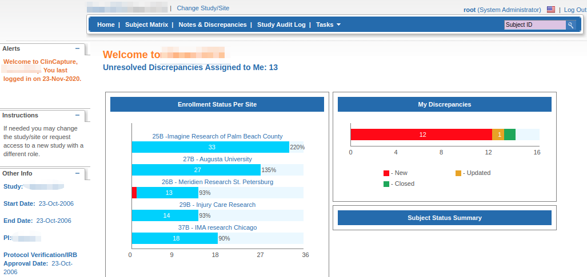

#ClinCapture EDC
The ClinCapture EDC system runs in the Flaskdata.io cloud.

You can use a standalone ClinCapture EDC instance or ClinCapture integrated with the Flask CTMS (clinical trial management system)(see the [FlaskData - ClinCapture integration for more information](./flask_and_edc.md#flask-and-edc))

ClinCapture is a full-featured, 21 CFR-compliant EDC system for multi-center clinical trials.

For more information, you can download the ClinCapture user guide here:

[ClinCapture User Guide](img/edc/ClinCaptureUserGuide.pdf){:target="_blank"}
