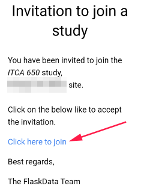

#ePRO
This is patient's diary.

##What is Flask PRO?
* Flask PRO is an online ePRO app
* Forms PRO unlimited subjects, forms and data. 
* You can create the ePRO yourself using a super friendly interface.  
* Runs on desktops, notebooks, tablets and phones.

##Prerequisites
###Study definition
To define [study](./manage_studies.md#add-study) with ePRO, the study should be defined as the following:
1. **Enable patient reported outcome module?**
3. **PRO URL**: should be **https://epro.flaskdata.io**, (If study has another PRO then FlaskData fill the *PRO URL* field with your study's PRO URL).

###Forms definitions
To define ePRO questionnaire, you need to create [CRF/s](./manage_forms.md#crfs) and [Event](./manage_forms.md#event-definitions) includes your diary CRF/s first.

Second you need to create [Study Schedule](./manage_forms.md#study-schedules) with your period diary.

##Welcome Email and SMS
When subject has been created the patient gets a welcome email and SMS with PRO link.

He/She is invited entering and fill his/her diary.

If patient forgets his password [site role user](./manage_users.md#profile) (like CRC or PI) can go to [subject's profile](./manage_subjects.md#actions) page and send him Welcome back/Reset password email.

Patient will get a welcome email again.

##Subject invited
When patient gets a welcome emil/SMS
 
 
 
 He/she should click on the link.

The patient is invited to login with his Google account OR to choose a password.

!!!note

    To create a password or reset password - CRC user should reset subject's password by clicking on [Reset password](./manage_subjects.md#subject-profile) option.
    
    The patient will get a reset password email
    
    
    
    After Subject set his/her password, He can login to ePRO by Google account or with FlaskData password
    
     
    
##Android application

###Installation
If patient has an Android phone, he can install Flask ePRO application from Google play store.

Search flask epro and install it

After patient install Flask ePRO application he will see the Flask ePRO icon

Just click on the application and login to ePRO, Enjoy :smile:

###Login to Flask ePRO
Open Flask ePRO application and login to your diary. (To login by email and password you should create the password first by [reset password](./epro_mobile.md#first-login-with-email-and-password) option)

###Enter diary

While patient logins to ePRO, he see his diary for the current date.

He should fill his diary and save.

If there are a few Forms in the diary the next form will be opened when he clicks **SAVE AND NEXT** button.

!!!important
    
    * If patient filed a part of his diary he can continue later.
    * If patient forgot to fill his diary, He can fill it next 2 days (By [logs](./#logs) option)
 
Required fields are marked with a red asterisk.

If patient try to save the diary with missing information, an error flag appears

Clicking on the error flag opens the error message.

 
###Input Data
Patient can click **Input Data** option and fill his diary for the current date.

If he saved his data before, He just see his data and cannot change it.

   
###Logs
Patient can see / continue his diaries in **Logs** option

###My Account
Patient can change his account definition by clicking on **My Account** option

He can change his default language.

!!!note "Support languages"

    For ePRO lunguages support customer admin user should define it in the [CRFs definition](./manage_forms.md#crfs)
    
    
    
Patient can change ePRO display mode by clicking on theme option.

    

If he sets the mode as **Dark** he will see something like this:

###Study information

The patient can see details of the study he is participating in by clicking on the exclamation mark

##FlaskData application
If subject cannot use [Flask ePRO](#android-application) android application he/she can use FlaskData application to enter his/her diary.

It's less beautiful but works great. :+1:

In any case in such a case that the phone does not support Android it is better for the patient to use his desktop.

###Login
Patient should login to FlaskData ePRO URL (https://epro.flaskdata.io)

 

###Input Data

When patient login to his diary a diary for the current date opens.

He can start to fill the diary.

If there are another Forms in the diary he should click **SAVE AND NEXT** button

If he filled the last form he should click **FINISH** button

When patient finish fill diary a success message appears

To go back to **Input Data** click on the icon

###Logs

Patient can see his diaries by **Logs** option

 

 
By logs option patient cannot change his diaries, just see them
 

!!!note "Forget Option"

    1. If patient filled diary but didn't finish all his diary forms he can continue from Logs option
    
        He can continue filling data for yesterday's diary and for the diary of two days ago.
    
    2. If patient forgot to fill his diary he can enter data for yesterday's diary and for the diary of two days ago.
   
###My Account

To see account definition click on **My Account** icon

!!!note Change language

    Patient can change the language by click on Languages icon - this option change the language for this login but it doesn't change patient account definitions, So in the next login the language will be the default language again.    
    

Save patient's account information after changing.

###Study information
The patient can see details of the study he is participating in by clicking on the exclamation mark

###Logout
After patient finish filling his diary he can logout from the system by clicking **Logout** icon.

    
    

    

