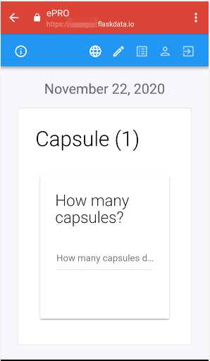

#ePRO
Desktop and native Android mobile app to collect patient reported outcomes.

##What is Flask PRO?
* Flask ePRO provides a desktop and native Android mobile app to collect patient reported outcomes.
* Use the visual Forms designer and deploy to desktop and mobile.

##Prerequisites
###Study definition
To define [study](./manage_studies.md#add-study) with ePRO, the study should be defined as the following:
1. **Enable patient reported outcome module?**
3. **PRO URL**: should be **https://epro.flaskdata.io**, (If study has another PRO then FlaskData fill the *PRO URL* field with your study's PRO URL).

###Forms definitions
To define ePRO questionnaire, you need to create [CRF/s](./manage_forms.md#crfs) and [Event](./manage_forms.md#event-definitions) includes your diary CRF/s first.

Second you need to create [Study Schedule](./manage_forms.md#study-schedules) with your period diary.

##Welcome Email and SMS
When subject has been created the patient gets a welcome email and SMS with PRO link.

The patient is invited to enter their diary.

If patient forgets their password [site role user](./manage_users.md#profile) (CRC or PI) can go to [subject's profile](./manage_subjects.md#actions) page and send them a Welcome Back- Reset password email.

Patient will get another welcome email.

##Subject invited
When patient gets a welcome email/SMS

They should click on the link.

The patient is invited to login with their Google account OR to choose a password.

!!!note

    To create a password or reset password - CRC user should reset subject's password by clicking on [Reset password](./manage_subjects.md#subject-profile) option.

    The patient will get a reset password email.

    

    After Subject sets their password, they can login to ePRO by Google account or with FlaskData password.

    

##Android application

###Installation
If the patient has an Android phone, they can install the Flask ePRO application from the Google play store.

Search "flask epro" and install it

After the patient installs the Flask ePRO application they will see the Flask ePRO icon

Just click on the application and login to ePRO, Enjoy :smile:

###Login to Flask ePRO
Open Flask ePRO application and login to your diary. (To login by email and password you should create the password first by [reset password](./epro_mobile.md#first-login-with-email-and-password) option)

###Enter diary

When the patient logins to ePRO, they see their diary for the current date.

They should fill in the diary and save.

If there are a few Forms in the diary the next form will be opened when the **SAVE AND NEXT** button is clicked.

!!!important

    * If the patient completed a part of their diary, they can continue later.
    * If patient forgot to complete in their diary, they can still complete it within the next 2 days (By [logs](./#logs) option)

Required fields are marked with a red asterisk.

If patient try to save the diary with missing information, an error flag appears

Clicking on the error flag will open the error message.

###Input Data
Patient can click the **Input Data** option and complete their diary for the current date.

If they saved his data before, they will only see the data and cannot change it.

###Logs
Patients can view and continue adding to diaries in the **Logs** option

###My Account
Patients can change their account definition by clicking on the **My Account** option

They can change his default language.

!!!note "Support languages"

    For ePRO lunguages support customer admin user should define it in the [CRFs definition](./manage_forms.md#crfs)

    

Patients can change ePRO display mode by clicking on theme option.

If they sets the mode as **Dark** they will see something like this:

###Study information

The patient can see details of the study they are participating in by clicking on the exclamation mark

##FlaskData application
If the subject cannot use [Flask ePRO](#android-application) android application they can use FlaskData application to enter their diary.

It's less beautiful but works great. :+1:

In the case that the patients phone does not support Android it is better for the patient to use their desktop.

###Login
The patient should login to FlaskData ePRO URL (https://epro.flaskdata.io)

###Input Data

When the patient logs into their diary, a diary for the current date opens.

They can start to fill the diary.

If there is another Form in the diary they should click **SAVE AND NEXT** button.

If they completed the last form, they should click **FINISH** button.

When the patient completes the diary, a success message appears.

To go back to **Input Data** click on the icon.

###Logs

The patient can see their diaries using the **Logs** option.

Using the logs option, the patient cannot change their diaries, only view them.

!!!note "Forget Option"

    1. If the patient filled their diary but didn't finish, they can continue using Logs option

        They can continue filling in data from yesterday's diary, as well as, from the diaries of two days ago.

    2. If the patient forgots to fill their diary, they can enter data for yesterday's diary and for the diary of two days ago.

###My Account

To see account definition click on the **My Account** icon

!!!note Change language

    Patient can change the language by click on the languages icon - this option change the language for this login but it doesn't change patient account definitions. In the next login the language will be set to the default language again.    
    

Be sure to save the patient's account information after changing.

###Study information
The patient can see details of the study they are participating in by clicking on the exclamation mark.

###Logout
After the patient finish completing their diary, they can logout from the system by clicking the **Logout** icon.
