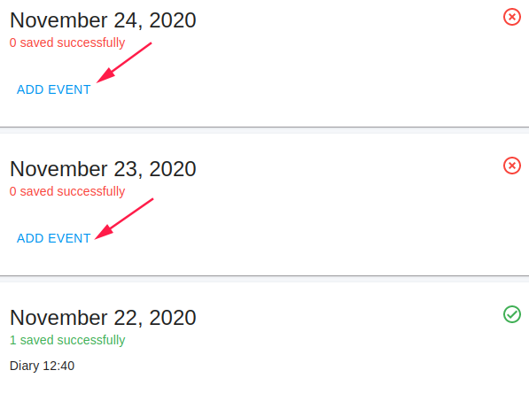

#Research diaries - completion instructions

This document specifies instructions for filling a patient diary.

Upon joining the study, you will have access to the electronic diary system designed for participants in the trial and designed for daily filling of tracking diary pages via mobile phone or computer.

##First login for using desktop
Before the first entry, you will receive a welcome email from Flask Data.
 
Upon receiving the email, you can enter and set a personal password for the system.

<iframe style="width: 100%;height: 450px;" src="https://www.youtube.com/embed/kVuR0Zh3_D0?rel=0&amp;showinfo=0" frameborder="0" allowfullscreen></iframe>

Set a password by the reset password email

<iframe style="width: 100%;height: 450px;" src="https://www.youtube.com/embed/FTbWHSwk4yM?rel=0&amp;showinfo=0" frameborder="0" allowfullscreen></iframe>

!!!note
    
    The link to the system is available from any mobile or stationary device
    
    <a href="https://epro.flaskdata.io/welcome" target="_blank">https://epro.flaskdata.io/welcome</a>
    
##First login for using Android mobile
This is a short video of diary using mobile.

<iframe style="width: 100%;height: 450px;" src="https://www.youtube.com/embed/ck9cpRyDxi0?rel=0&amp;showinfo=0" frameborder="0" allowfullscreen></iframe>

##Diary Options
This is a short video with example of patient's diary options.

1. See their diary data 
!!!note
    Diary Data cannot be changed after saving.
2. See their diary logs
3. Change languages
4. Change display mode
5. See study details.

<iframe style="width: 100%;height: 450px;" src="https://www.youtube.com/embed/AQ82yyIu8N0?rel=0&amp;showinfo=0" frameborder="0" allowfullscreen></iframe>

!!!important

    * Upon completion of all the required details, make sure you click on the **Save and Next** or **Finish** control (this is so that all the information will be saved).
    * By clicking on the text **Data log** you can find the logs that are waiting to be filled in by you.
         * In the relevant box for the day of filling in, click on **Add Event**
         * Enter the diary you need to fill out. Be sure to fill in the daily diary and all the details in order every day. When the filling is complete, click on **Finish**
         * Please note that the daily log of yesterday and the day before can be completed - the details of the log cannot be completed backwards of 3 days or more.
         
         
Thank you for joining the study :heart: