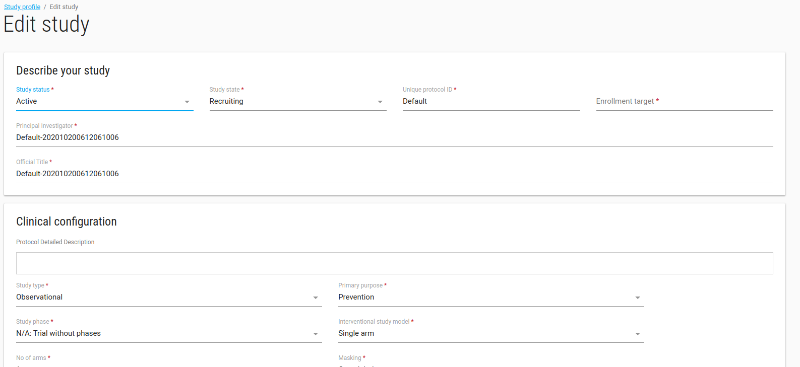
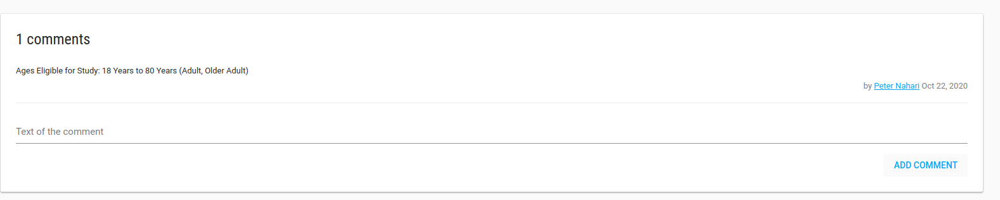
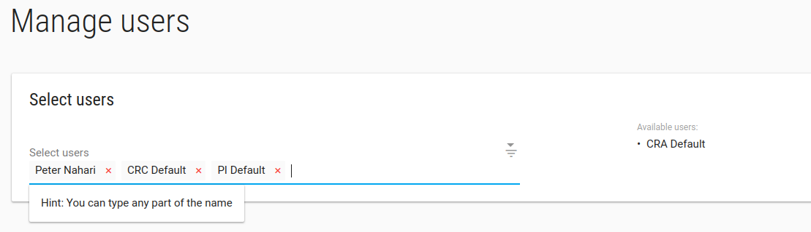
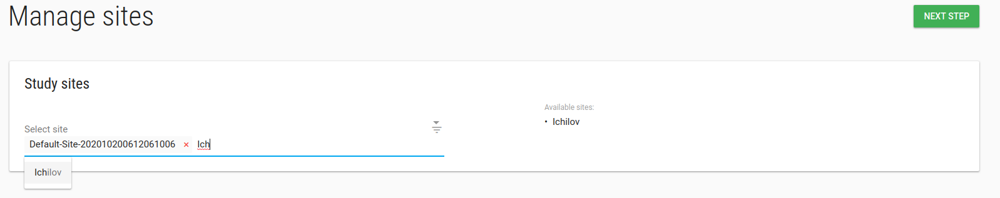

<a href="https://www.flaskdata.io"></a>

#Define your study
After signing up, the system will create your first study called ```default-XXX```.

##Study Edit
To edit the study - check it, in **ACTIONS** click on **Edit** option.


 In edit study window you can define your study profile, definitions and etc.

 

---
**NOTES:**

1. *Database* and *EDC URL* fields are related to EDC db, if you have EDC (ClinCapture) db you should fill them.
2. *Enable patient reported outcome module?* Check this checkbox if your study has a PRO for patients.
3. *PRO URL*: If study has another PRO then FlaskData fill the *PRO URL* field with your study's PRO URL.
4. *Package*: There are 3 available packages, Start, Submit and Validate.
    * Start - study uses IRB and Forms
    * Submit - Flask+Forms+Tools+EDC. Unlimited sites.
    * Validate - Flask+Forms+Tools+EDC. Limited to 3 sites.
5. *Alert data source*: Data for alert definitions (If study uses clinCapture you should choose PostgreSQL otherwise choose MongoDB).
6. *Study subject prefix*: Prefix of creation subject label, like study1-001.
7. *Subject’s IDPs settings*: IDP settings for subjects-patients.
---

When you click **SAVE** the profile study will be opened.

##Study Profile
In the Study Profile page you can see your study's definitions, alert rules, analytic rules, Users, sites and comments.

  
---
**NOTE:** In comments card you can record free text annotations about your study.


---
In Study Profile page you have **ACTIONS** green button with manage Users and manage sites options.

##Study manage Users
In Manage Users page you can add/remove User from this study.

To add a new User to the study - you need to [create the User](./manage_users.md#add-user) first.



Type any part of the User's name in the Select Users box and choose the relevant User.


Click **NEXT STEP**, Welcoma emails will be sent to Users' emails.

##Study manage sites
In Manage sites page you can add/remove site from this study.

To add a new site to study - you need [create the site](./manage_sites.md#add-a-new-site) first.



Type any part of the site's name in the Select sites box and choose the relevant site.

Click **NEXT STEP**
