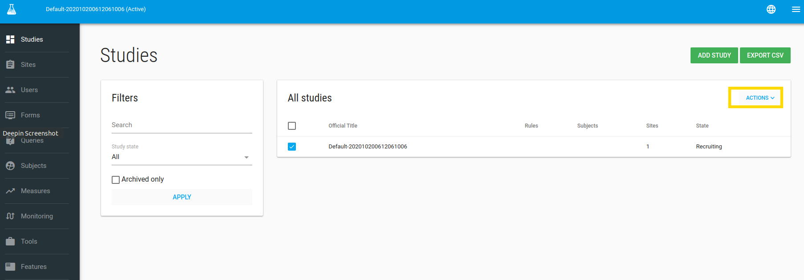

#Define your study
After signing up, the system will create your first study called `default-XXX`.

##Study Edit
To edit the study - check it, in **ACTIONS** click on **Edit** option.

 In edit study window you can define your study profile, definitions etc.

 

!!! note "Study definition values"

    1. Fill out the *Database* and the *EDC URL* fields if you are using an external EDC like ClinCapture.
    2. *Enable patient reported outcome module?* Click this checkbox if your study uses Flask ePRO [desktop](./epro.md#flaskdata-application) / [Mobile](/epro.md#android-application) edition.
    3. *PRO URL*: Enter the *PRO URL* field with the Website address of your ePRO system - if your'e using Flask ePRO, then the default will be <a href="https://epro.flaskdata.io">Flask ePRO </a>.
    4. *Package*: There are 3 available packages, Start, Submit and Validate.
        * Start - The study uses Flask Subject management and Flask Forms for data Collect.
        * Validate - Start + ClinCapture EDC  on the Flaskdata cloud platform.
        * Submit - Start + external EDC
    5. *Alert data source*: Data for alert definitions (If study uses ClinCapture you should choose PostgreSQL otherwise choose MongoDB).
    6. *Study subject prefix*: Prefix for automatically creating a Subject label like - NCT123456-001
    7. *Subject’s IDPs settings*: Enable Subjects to login with their Google Account or enable Subjects to login
    with multiple identity providers.

When you click **SAVE** the profile study will be opened.

##Study Profile
The Study Profile page shows your study's attributes; Alert rules, Analytic rules, Users, Sites and comments.

  

!!! note "Comments"

    In the Comments card you can record free text annotations about your study.

    

In the Study Profile page you have a green **ACTIONS**  button with Manage users and Manage sites options.

##Study > Manage Users
In the Manage Users page you can add/remove User from this study.

To add a new User to the study - click [create the User](./manage_users.md#add-user) .

Type any part of the User's name in the Select Users box and click the user you want to add to the study.

Click **NEXT STEP**, Welcome emails will be sent to the users.

##Study > Manage sites
In the Manage sites page you can add/remove site from this study.

To add a new site to study - click [create the site](./manage_sites.md#add-a-new-site) first.

Type any part of the site's name in the Select sites box and click the site you want to add to the study.

Click **NEXT STEP**
