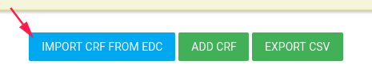
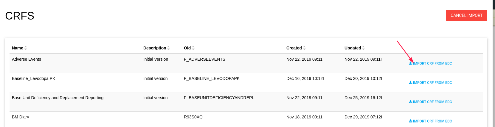
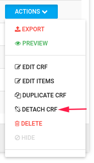
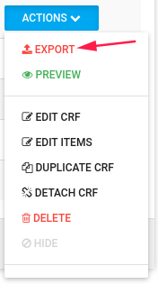
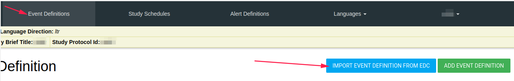
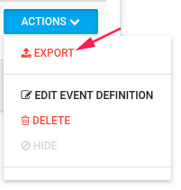
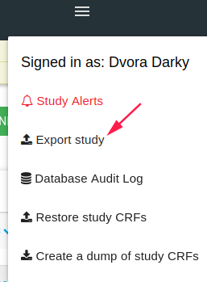

#Flask and EDC
You can use FlaskData and [ClinCapture Database](./manage_studies.md#add-study) in parallel for your study.

There are a few functions to connect them:

1. [Create user in EDC feature](./manage_features.md#create-user-in-edc) - Create user in flask and he/she will be created in EDC.
2. [Create site in Flask](./manage_sites.md#add-a-new-site) - The site will be created in EDC.     
3. [Add subject in Flask](./manage_subjects.md#add-subject) - The subject will be added in EDC.
4. [EDC button](./study_dashboard.md#edc) - Opens the clincapture in a new window.
5. See EDC Queries in [tools](./tools.md).
6. [Download EDC data](./tools.md#download-study-data-csvs) (CSV files)
7. [Connect Forms data and EDC data.](flask_and_edc.md#relationship-between-forms-and-edc)

!!!important "Create site"

       EDC has a lot of connectivity, After you add a site in Flask you must go to EDC and "edit" the site.

       Just Click edit and save without edit anything.

##Relationship between Forms and EDC
If your study uses [ClinCapture Database](./manage_studies.md#add-study) you can connect the two.

###Import CRF from EDC
You can import CRF From EDC to Forms by click on **IMPORT CRF FROM EDC** blue button

CRF list opens, You can import each CRF you need.

After you imported, you can [edit the CRF](./manage_forms.md#edit-crf-item).

Now - You have CRF in Forms related to EDC CRF.

Each CRF data you enter or edit for specific subject in Forms will update the EDC CRF data.

For detach the CRF from EDC CRF, Go to CRF list **ACTIONS**->**DETACH CRF**

 

###Export CRF to EDC
You can export CRF to EDC by click on **ACTIONS**->**EXPORT** option

 

!!!example

     Study uses Flask PRO and EDC DB, You can export study PRO CRFs to EDC.

     When subject inserts data in ePRO the data is inserted into EDC as well.

###Import Event from EDC
You can import event from EDC includes all it's CRFs.

In Event Definition tab click on **IMPORT EVENT DEFITION FROM EDC** blue button

Events list appears, you can import each event from there, edit the imported event, and it's CRFs.

###Export Event to EDC
You can export Event to EDC by click on **ACTIONS**->**EXPORT** option

The export window **Difference between Flask Event Definition and EDC Event Definition preview** shows the event's different definitions between Forms and EDC.

You can export or cancel the export process.

###Export study
By click on **Export study** [Hamburger](./manage_forms.md#hamburger) option, You can export to EDC DB all the Events and CRFs of ths study.

