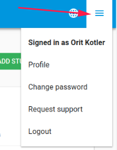

#FlaskData
**Collect, Detect and Act**

FlaskData is a cloud API platform to collect and monitor clinical data.

FlaskData helps you achieve high levels of protocol compliance and save time and money by automating the manual work of compliance monitoring in clinical trials.  

The FlaskData platform provides real-time data collection and automated detection and response. An open [API](https://api.flaskdata.io/swagger)  architecture fits easily into any digital health, digital therapeutics or eClinical software.  Flask collects data from any combination of sources – investigators, patients, mobile, wearables, passive monitoring, connected medical devices and code.

Collect provides you with desktop, mobile and RESTful Flask Data [API](https://api.flaskdata.io/swagger/) services to collect data directly from patients, investigators and connected medical devices.

Detect  provides you with the capability to automated deviation monitoring of all your clinical data continuously. This is based on techniques used widely in cyber security – read more here about
[An attack modeling approach for monitoring clinical data](https://www.flaskdata.io/an-attack-modeling-approach-for-remote-monitoring-of-clinical-trials/)

Act  provides you with the capability to automate response to patients and clinical operations teams with push notifications triggered by computed protocol compliance metrics over threshold.

Read more about the Flaskdata software architecture here:  [Flaskdata software architecture white paper](https://www.flaskdata.io/flaskdata-software-architecture-white-paper/)

##Introduction

###Learning objectives
* What is Flask Data ?
* Understand concepts
* Use basic functions

####Basic concepts
* Study – a clinical trial or research study.
* Site – hospital or clinic
* Study event – a visit of a study subject at a site during a study. A study event contains 1 or more eCRFs
* eCRF – electronic case report form. 
* Item – a question on an eCRF

####User interface (UI)
* Web application that runs in your browser
* All modern browsers including Chrome and on Windows
* Windows, Linux and Mac
* Basic UI after login
* Top level status info with Change [Site](./manage_sites.md#Edit Site)/[Study](./manage_studies.md#Study Edit)
* To navigation  bar
* Left side bar
* Body
* Plus(+)/minus(-) signs to expand/contract content
* Navigation buttons – Submit, Back etc…

###Roles – who can do what?
| Flask Role         | Customer Admin Role  | Study Role      |  Site Role     |
| -------------------| ---------------------|-----------------|----------------|
| `Users`            | :material-check:     | :material-close:|:material-close:|
| `Subjects`         | :material-close:     | :material-check:|:material-check:|
| `Studies`          | :material-check:     | :material-check:|:material-check:|
| `Sites`            | :material-check:     | :material-close:|:material-close:|
| `Forms design`     | :material-check:     | :material-check:|:material-close:|
| `Forms data entry` | :material-close:     | :material-check:|:material-check:|

###User profile
* Top line always shows User Name and Role 
  - Currently logged-in user and role 
  - Click on here at any time to access and change your User Profile – including changing your password.
  
  
  
###Logout
* Logout – use the logout button
* Don’t just close the browser
  - This will leave open sessions on the server and potentially cause problems
  
