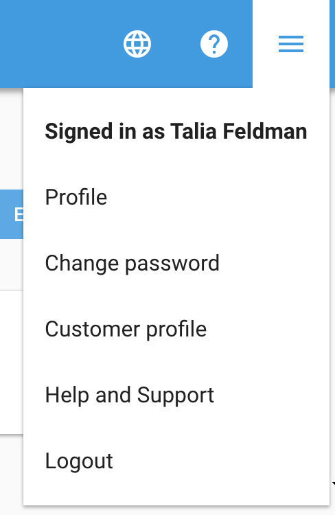
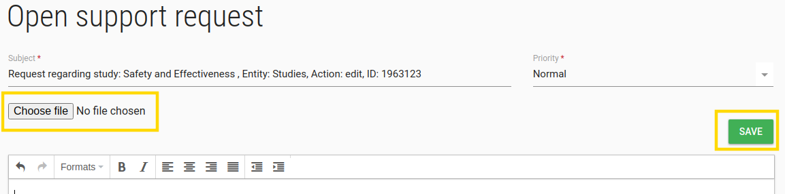
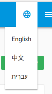
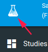

#FlaskData
**Collect, Detect and Act**

FlaskData is a cloud API platform to collect and monitor data in clinical trials.

The FlaskData platform provides mobile, desktop and API services to collect clinical data.
The Flask  [API](https://api.flaskdata.io/swagger)  can be integrated into any code that can call a RESTful API.  

There are 3 main sub-systems in Flask - Collect, Detect and Act.

Collect provides desktop, mobile and RESTful Flask  [API](https://api.flaskdata.io/swagger/) services to collect data directly from patients, investigators and connected medical devices.   Collect includes the visual Flask Forms designer
to design eCRFs and publish as eSource and ePRO desktop and native Android mobile apps.

Detect  provides a capability to automate monitoring of clinical data quality, efficacy and safety using rules
and thresholds to detect protocol deviations and missing data on the patient journey.

Act  provides the capability to automate delivery of alerts to patients and clinical operations teams when triggered
by the detect metrics over/under threshold.

Read more about the Flaskdata software architecture here:  [Flaskdata software architecture white paper](https://www.flaskdata.io/flaskdata-software-architecture-white-paper/)

##Introduction

###Learning objectives
* What is Flask Data ?
* Understand concepts
* Use basic functions

####Basic concepts
* Study – a clinical trial or research study.
* Site – hospital or clinic
* Study event – a visit of a study subject at a site during a study. A study event contains 1 or more eCRFs
* eCRF – electronic case report form.
* Item – a question on an eCRF
* EDC - Electronic Data Capture

####User interface (UI)
* Web application that runs in your browser
* All modern browsers including Chrome and on Windows
* Windows, Linux and Mac
* Basic UI after login
* Top level status info with Change [Site](./manage_sites.md#Edit Site)/[Study](./manage_studies.md#Study Edit)
* To navigation  bar
* Left side bar
* Body
* Plus(+)/minus(-) signs to expand/contract content
* Navigation buttons – Submit, Back etc…

###Roles – who can do what?
| Flask Role         | Customer Admin Role (2) | Study Role (3)     |  Site Role (4)    |
| -------------------| ---------------------|-----------------|----------------|
| `Users`            | :material-check:     | :material-close:|:material-close:|
| `Subjects`         | :material-close:     | :material-check:|:material-check:|
| `Studies`          | :material-check:     | :material-check:|:material-check:|
| `Sites`            | :material-check:     | :material-close:|:material-close:|
| `Forms design`     | :material-check:     | :material-check:|:material-close:|
| `Forms data entry` | :material-close:     | :material-check:|:material-check:|

###User profile
* Top line always shows User Name and Role
  - Currently logged-in user and role
  - Click on here at any time to access and change your User Profile – including changing your password.

{: style="height:300px;width:200px"}

###Change password
Change password allows you to change your password when you want,

Just click on **Change password** option, a reset password email will send to you.

###Customer Profile
Customer Profile allows you to edit customer properities (by clicking on the pen in the top right corner of the Customer properties card). 
You are also able to add comments and entries into Customer MetaData. These entries will allow users to short cut get() commands in Forms, which allows data extraction while keeping external data secured.

###Request support
If you need support from us, click on this option.

A request support page will be opened.

Write your request, you can upload file.

**Please detail your request as much as possible**

**Every effort will be made to get back to you soon.**

###Logout
* Logout – use the logout button
* Don’t just close the browser
  - This will leave open sessions on the server and potentially cause problems

###Languages
You can change your app language, by press on the languages' symbol.

###FlaskData Logo
Clicking on FlaskData logo opens [Study Dashboard](./study_dashboard.md#study-dashboard) page.

{: loading=lazy }
