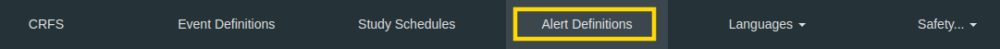
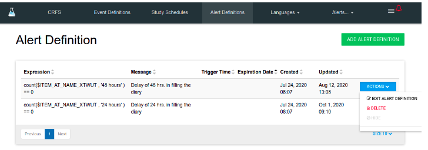
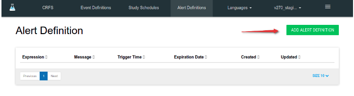
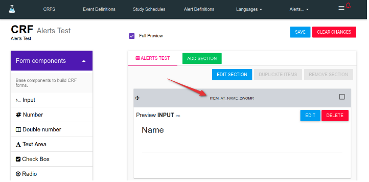
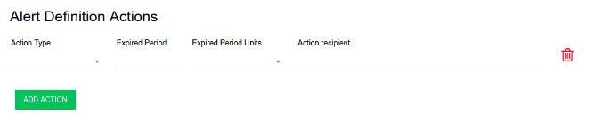
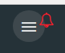
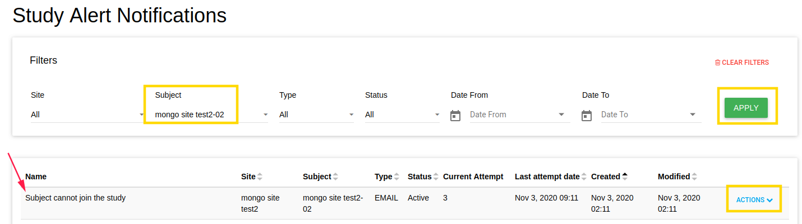

<a href="https://www.flaskdata.io"></a>

#Alert Definitions
In Flask Forms you can create alert definitions for your study.



Alert Definition entity was designed for use in the data analysis process.
 
Alert Definition allows determining the expression that will be used for data checking and the actions that will be executed if the expression returns true.

In the Actions dropdown, you can find the Delete and Edit Alert Definition buttons.




##Add Alerts Definition
In order to add alert definition click on **ADD ALERT DEFINITION** green button.



There are few properties of alert definition:

* **Message** - the message of the alert, this message will appear in this alert email.
* **Expiration Date** - optional field, if this alert definition has end date.
* **Send email to subject** - select it If this alert definition requires to send email to subject about this alert.
* **SMS Message** - this message will appear in this alert SMS (if Send SMS to subject is marked)
* **Trigger Time** - optional field, time of alert generation. If this field is empty - alert will generate in real time.
* **Send SMS to subject** - select it If this alert definition requires to send SMS to subject about this alert.
* **Expression** - see [Expression](manage_alerts_definitions.md#alert-language)
* **Alert Definition Actions** - which action to do with this alert. see [Expression](manage_alerts_definitions.md#alert-action)

##Alert Language
Flask Alert Language was designed to provide the ability for users to create rules to find the errors, missing data, or critical values in the subject's data.

This language is based on the CRF items variables.
When the CRF was created each item of this CRF gets a unique variable that looks like "ITEM_AT_NAME_2WOMR".



In the future, each answer of the subject will be marked with this variable and stored in the DB.

To find the errors, missing data, or critical values in the subject's data you need to create the expression close to the JavaScript programming language.

If this expression will return true - you will get the alert.

In current implementation you can use the simple expressions like `$SOME_VARIABLE == '0'`,
 
 or expressions with functions like `count($SOME_VARIABLE) == '0'` or `filter($SOME_VARIABLE) == '0'`.

Also, you can combine these expressions using logical operators like `&&`(AND) or `||`(OR).

!!!example "Examples"
 
    *  `$SOME_VARIABLE == '0' && count($ELSE_ONE_VARIABLE) > '0'`
    * `$SOME_VARIABLE != 'some string value' || $ELSE_ONE_VARIABLE >= '0'`
    * `filter($SOME_VARIABLE) <= '4' && count($ELSE_ONE_VARIABLE) != '5'`

Logical operator !(NOT) also supporting in the current implementation

!!!example "Examples"
 
    * `!($SOME_VARIABLE == '5') && count($ELSE_ONE_VARIABLE) > '0'`
    * `!($SOME_VARIABLE == 'some string value')`


###Functions

####Count
**count(variable, period)**- this is the general syntax of count function.

The count function will return the number of records in the DB marked with this variable.

The count function receives the two arguments:

* variable - the unique variable of the CRF item.
* period(not required) - the time period for filtering the subject's data by date of creating the record.

The value of the period parameter must be the string that looks like `24 hours`

!!info

    You can use the following time units:
    
    * milliseconds
    * seconds
    * minutes
    * hours
    * days
    * weeks
    * months
    * years

!!!example "Usage examples:"
    
    * `count($ELSE_ONE_VARIABLE)` - will return the number of records with variable $ELSE_ONE_VARIABLE for the all-time
    * `count($ELSE_ONE_VARIABLE, '24 hours')` - will return the number of records with variable $ELSE_ONE_VARIABLE for the last 24 hours
    * `count($ELSE_ONE_VARIABLE, '7 days')` - will return the number of records with variable $ELSE_ONE_VARIABLE for the last week

So, if you need to check did some subject fill some CRF during of 24 hours you can use the following expression:

```JavaScript
count($ELSE_ONE_VARIABLE, '24 hours') == '0';
```

In this case, if some subject didn't fill the CRF that contains an item with the current variable during 24 hours the function `count($ELSE_ONE_VARIABLE, '24 hours')` will return 0. The entire expression `count($ELSE_ONE_VARIABLE, '24 hours') == '0'` will return true and you will get the alert.

####Filter
**filter(variable, period, value, take)** - this is the general syntax of the filter function.

The filter function will return the number of records in the DB marked with this variable.

The count function receives the following arguments:

* variable - the unique variable of the CRF item.
* period(not required) - the time period for filtering the subject's data by the date of creating the record.
* value(not required) - the expression that will be used for filtering by the value that a record contains
* take(not required) - the expression that will be used to get the part of the records array

The period parameter works similarly to the period parameter in the [count](manage_alerts_definitions.md#count) function.

The value of the value parameter must be the string that looks like `>2`, `yes`, `==5`

!!!info
    You can use the following operators:
    
    * `==`
    * `!=`
    * `>=`
    * `<=`
    * `>`
    * `<`

!!!example

    * `==2`
    * `some string value`
    * `>=5`

!!!note ""

    the expression `==2` and `2` or  `==yes` and `yes` are equals!

The value of the **take parameter** must be the string that looks like `'-1'`, `'1'`, `'5'`

The **take parameter** provides the ability to get the part of records from the records array.

!!!example "Examples"

    * `'1'` - The first event
    * `'2'` - The first 2 events
    * `'-1'` - The last event
    * `'-4'` - The last 4 events

!!! note ""
    the records that receive from the DB ordered by date created.

The order of the filters appling is following

1. filtering by variable
2. filtering by period
3. filtering by 'take'
4. filtering by 'value'


!!! note ""

    if you don't need to use some parameter you can set null instead.

!!!example "Usage examples"

* `filter($ELSE_ONE_VARIABLE)` - will return the number of records with variable $ELSE_ONE_VARIABLE for the all-time
* `filter($ELSE_ONE_VARIABLE, '24 hours')` - will return the number of records with variable $ELSE_ONE_VARIABLE for the last 24 hours
* `filter($ELSE_ONE_VARIABLE, '24 hours', '>=5')` - will return the number of records with variable $ELSE_ONE_VARIABLE for the last 24 hours that contains the value more or equal '5'
* `filter($ELSE_ONE_VARIABLE, null, '>=5')` - will return the number of records with variable $ELSE_ONE_VARIABLE for the all-time that contains the value more or equal '5'
* `filter($ELSE_ONE_VARIABLE, null, '>=5', '2')` - at first, will find all records with variable $ELSE_ONE_VARIABLE for the all-time. The next step - will receive the first 2 members of this array. Finally - will return the number of the records from the array that received in step two that contains the value more or equal to '5'

So, if you need to check did some subject has some critical value in his data  during of 24 hours you can use the following expression:

```JavaScript
    filter($ELSE_ONE_VARIABLE, '24 hours', '>10') > '0';
```

In this case, if some subject entered this critical value in the CRF that contains an item with the current variable during 24 hours the function 

```JavaScript
filter($ELSE_ONE_VARIABLE, '24 hours', '>10')
```
will return some value that will be more than 0. 

The entire expression `filter($ELSE_ONE_VARIABLE, '24 hours', '>10') > '0'` will return true, and you will get the alert.

####Simple expressions
In current implementation you can use the simple expressions like `$SOME_VARIABLE == '0'`.

In this case this expression will be replaced to `filter($SOME_VARIABLE, null, '== 0') != 0`

!!!example
    
    | Input                            |  Output             |
    | --------------------------------| ---------------------|
    | `$SOME_VARIABLE == '0'`         | `filter($SOME_VARIABLE, null, '== 0') != 0` |
    | `$SOME_VARIABLE`                | `filter($SOME_VARIABLE, null, null) != 0`|
    | `$SOME_VARIABLE == '3'&& $ELSE_ONE_VARIABLE > '2'` |  `filter($SOME_VARIABLE, null, '== 3') != 0 && filter($ELSE_ONE_VARIABLE, null, '>2') != 0`  | 

##Alert Action
You can define a few actions to alert definition by **ADD ACTION** green button.



These actions are additional settings that allow adding additional recipients to send email or SMS. 

In the current time supported SMS and email actions.  

Each action has a few properties:

* **Action Type** - Send Email/SMS if there is alert.
* **Expired Period** - If alert will be expired after a period of its generation.
* **Expired Period Units** - seconds/ minutes/ days etc.
* **Action recipient** - email or phone number that will get an email/SMS about this alert.


##Study Alerts
If there are alerts of your study you can see a red bell in Forms near the hamburger.


To see alerts list - click on Study Alerts in hamburger menu.

You can filter the alerts list.

!!!tip

    You can change status/ delete each alert in the list.




