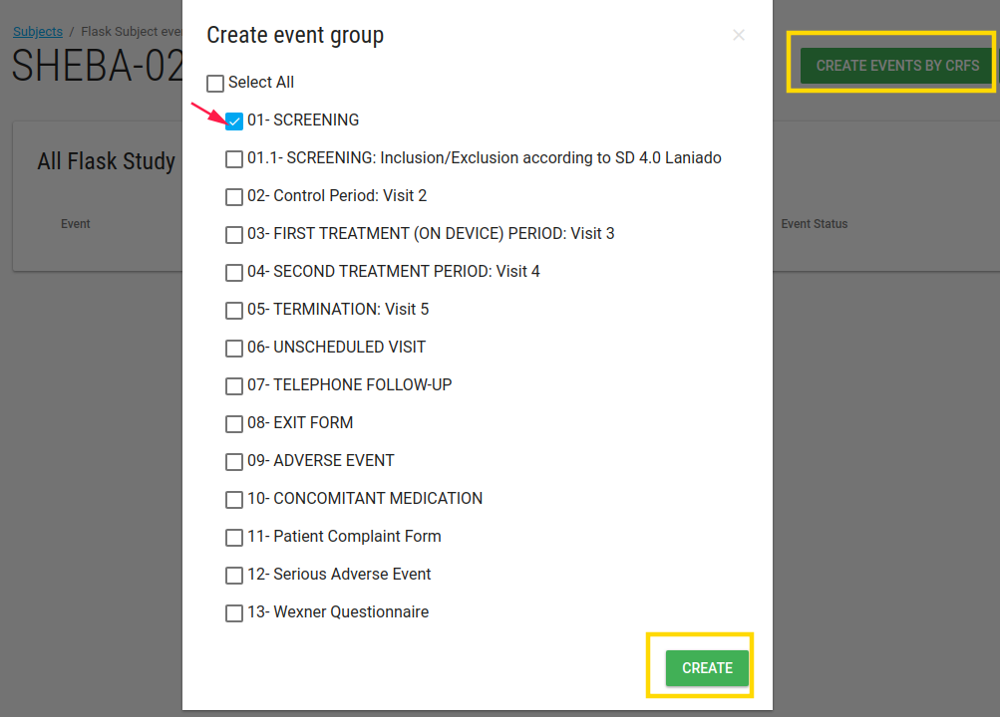

#Manage Data

##Learning Objectives
* Understand data entry controls
* Enter, save, edit data
* Mark CRF complete
* [View Audit history](./manage_forms.md#hamburger)

##Add subject
* Site CRC and PI roles can add subjects.
* Study role- Administrator can not add new subjects
For additional information [how to add subject](./manage_subjects.md#add-subject).

##Scheduling events
* Events can be scheduled before data entry
* Scheduling an event simply means entering the (planned) start date of that event for that subject. 
  You can schedule a number of events at once, or just schedule them when you wish to start data entry for the eCRFs.
  
###Create event by CRF
In s ubject Flask Events page there is a green button **CREATE EVENT BY CRF**
  
This button open **Create event group** card with events list.
  
Check the relevant event.
  

  
The event will be added to subject's events list.
  
###Enter Data
Site role user can enter data in each CRF in the event.
  

The CRF opened, user enter the data. In the end of CRF there are a few options:

* Mark as close - If you mark CRF as 'Closed', you will be not able to change the data next time (unless customer admin user reopen the CRF).
* Save and back - Save this CRF and go back to the prev CRF in this event.
* Save and next - Save this CRF and go to the next CRF in this event.
  

After site role user (like CRC) entered data, the last edited and status values are updated.
  

   
###Edit Data
After user entered data he/she can edit data (if CRF is not closed).

The Enter data button shifts to Edit Data button.

###Add CRF/ Delete Event

In the end on the event's CRFs list there are 2 buttons:
  
* **ADD CRF** to add CRF in this event.
* **DELETE EVENT** to delete this event.
  

  
---
**NOTE** If subject has PRO all PRO events are generated when the subject created.
  
___
