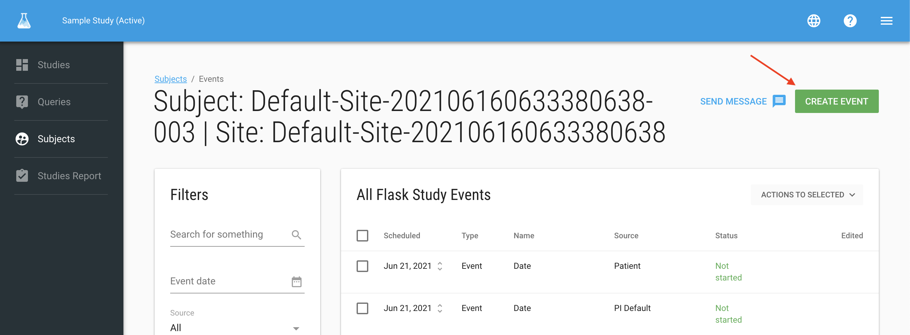
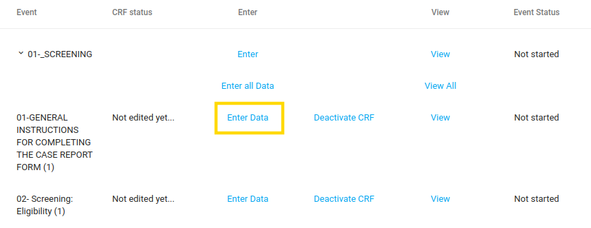
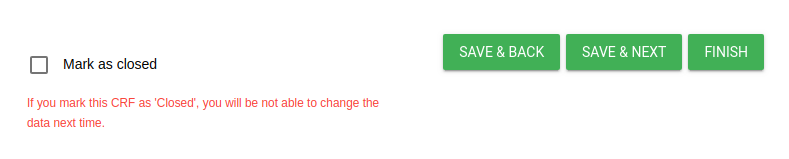
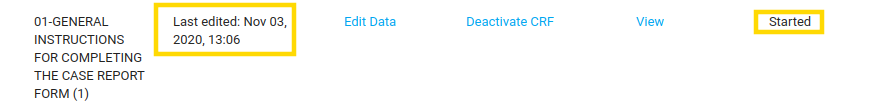
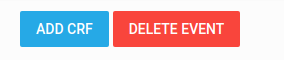
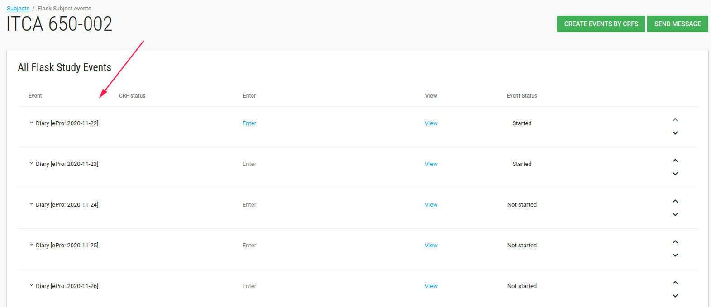

#Manage Data

##Learning Objectives
* Understand the data entry controls
* Enter, save, edit data
* Mark CRF complete
* [View Audit history](./manage_forms.md#hamburger)

##Add subject
* Site CRC and PI roles can add subjects.
* Study role- Administrator cannot add new subjects
For additional information [how to add subject](./manage_subjects.md#add-subject).

##Scheduling events
* Events can be scheduled before a data entry.
* Scheduling an event simply means entering the (planned) start date of that event for that subject. 
  You can schedule a number of events at once, or just schedule them when you wish to start data entry for the eCRFs.
  
###Create event by CRF
In the subject page, after selecting a subject, there is a green **CREATE EVENT** button
  
This button open the **Create event group** card with event lists.
  
Check the relevant event.
  

  
The event will be added to the subject's events list.
  
###Enter Data
Site role user can enter data in each CRF in the event.
  

With the CRF opened, the user can enter the data. At the end of the CRF, there are the following options:

* Mark as close - If you mark CRF as 'Closed', you will be not able to change the data next time (unless the customer admin user reopen the CRF).
* Save and back - Saves this CRF and goes back to the previous CRF in this event.
* Save and next - Saves this CRF and goes to the next CRF in this event.
  

After site role users (i.e. CRC) enters data, the last edited and status values are updated.
  

   
###Edit Data
After user entered data he/she can edit data, as long as the CRF is not closed.

The Enter data button shifts to Edit Data button.

###Add CRF/ Delete Event

In the end on the event's CRFs list there are 2 buttons:
  
* **ADD CRF** to add CRF in this event.
* **DELETE EVENT** to delete this event.
  

  
!!! info
 
    If subject has PRO all first period PRO events are generated when the subject created.
    
   

##Short video example of adding subject and inserting data

<iframe width="560" height="315" src="https://www.youtube.com/embed/tTwSPX_E6co" title="YouTube video player" frameborder="0" allow="accelerometer; autoplay; clipboard-write; encrypted-media; gyroscope; picture-in-picture" allowfullscreen></iframe>

<iframe width="560" height="315" src="https://www.youtube.com/embed/inO37AKVM5Y" title="YouTube video player" frameborder="0" allow="accelerometer; autoplay; clipboard-write; encrypted-media; gyroscope; picture-in-picture" allowfullscreen></iframe>

