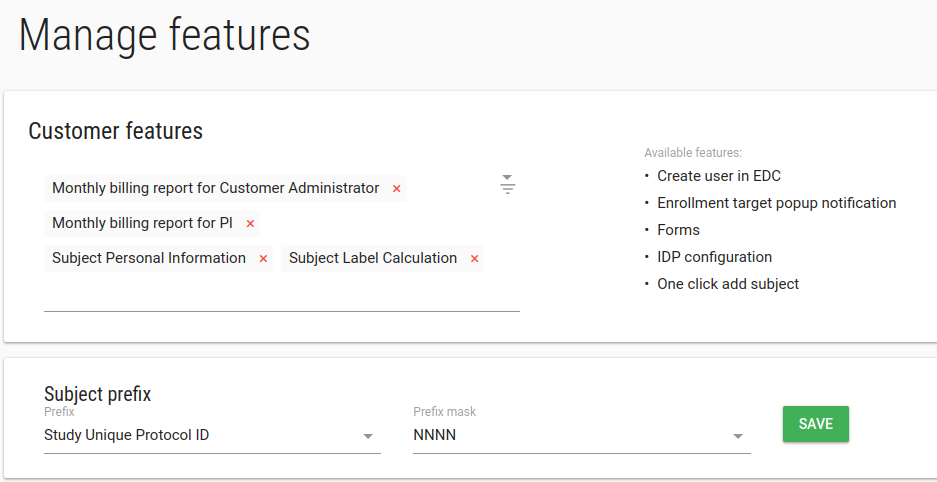
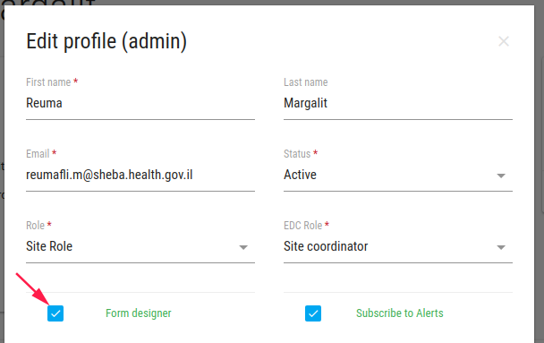
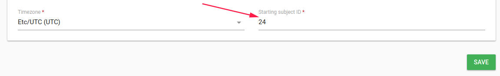
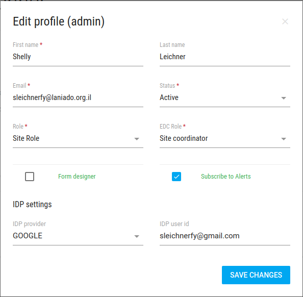
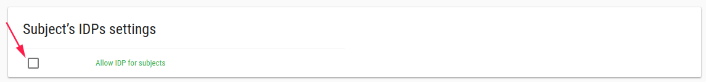

#Features

In order to manage customer features, click on **Features** in the left bar.

There are a few available features.

##Forms
To add/remove Forms from the left bar - add/delete it from your customer features.

If this feature is turn on, **Form designer** field will be added to [user edit](./manage_users.md#edit-user)

If you mark **Form designer** option, this user can enter to [Flask Forms](./manage_forms.md#manage-forms) and modify CRFs, Events etc.

---
**NOTE** By default only Customer admin users can enter to Flask Forms.

-- 

##Create user in EDC
This feature related to study with EDC DB.
It creates user in EDC when you create user in Flask.

##Enrollment target popup notification
Each study has [Enrollment Target](./manage_studies.md#study-edit) value.

This feature popup a warning message when user add subject, If the number of patients is greater than enrollment target number.

##Monthly billing report for Customer Administrator
This feature sends billing report in each month (In the end of the month) to customer admin user by his/her email.

##Monthly billing report for PI
This feature sends billing report in each month (In the end of the month) to PI user by his/her email.
 
##One click add subject
Add subject with one click on [ADD SUBJECT](./manage_subjects.md#add-subject) button

This feature creates a subject without real email and phone.

If study has PRO this feature is not supported.

If CRC user assign to 2 sites and more this feature is not supported (the user should check the relevant site).

This feature relates to **Subject Label Calculation** feature.

##Subject Label Calculation
This feature adds subject with an automatic label number.

**Subject Prefix**
* **Prefix** Subject label can be defined to start with [study unique protocol id](./manage_studies.md#study-profile) or [site unique identifier](./manage_sites.md#site-profile)
* **Prefix mask** number of numbers after the Prefix

**Example** Prefix = Site unique identifier, Prefix mask = NNN, subjects label seems like site01-001, site1-002 etc.

---
**NOTE** If you have existing study, Go to [study edit](./manage_studies.md#study-edit) to define the subject prefix calculation node.

---
You can change the subject numerator to specific [site](./manage_sites.md#edit-site)/[study](./manage_studies.md#study-edit).

**Example** If you define your study subject prefix to "site unique identifier",

You can go to [site edit](./manage_sites.md#edit-site) or [site add](./manage_sites.md#add-a-new-site) and change the **Starting subject ID** to the desired number.

The next patient label will be with this number (SHEBA-024).

##Subject Personal Information
This feature adds more fields to [add subject](./manage_subjects.md#add-subject) function.

* First name
* Last name
* ID Number/Passport
* Subject signed the ICF

##IDP configuration
This feature allows you to add GOOGLE Account to user, For customers without their own IDPs like SAML or OpenId.

In [add user](./manage_users.md#add-user) and [edit user](./manage_users.md#edit-user) you can define additional GOOGLE accounts to user.

This feature allows the user to log in to Flask with multiple GOOGLE accounts.

If you want to enable this feature to subject also, you should define it in your [study](./manage_studies.md#study-edit)

