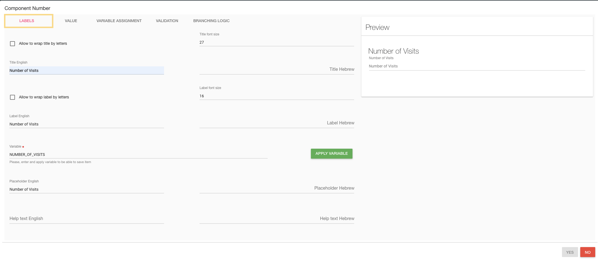
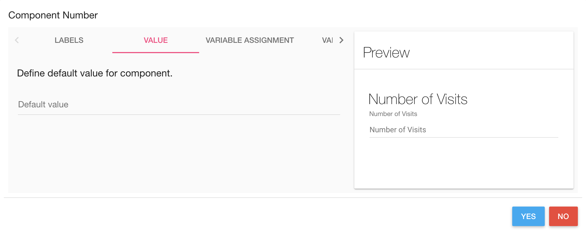
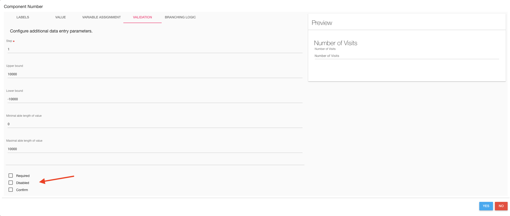
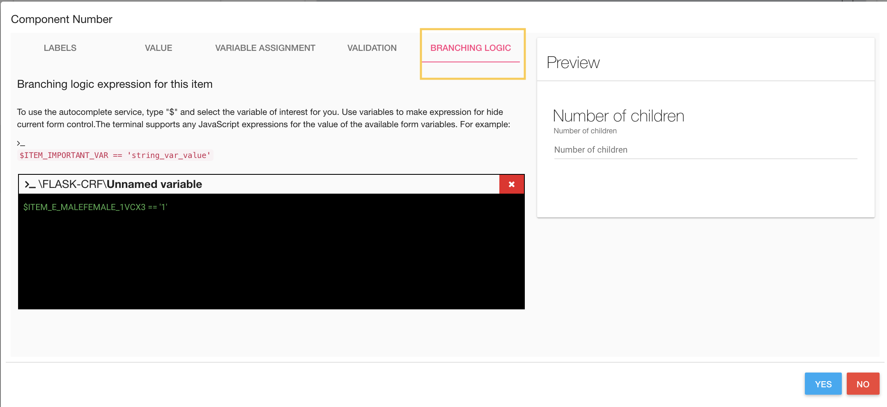
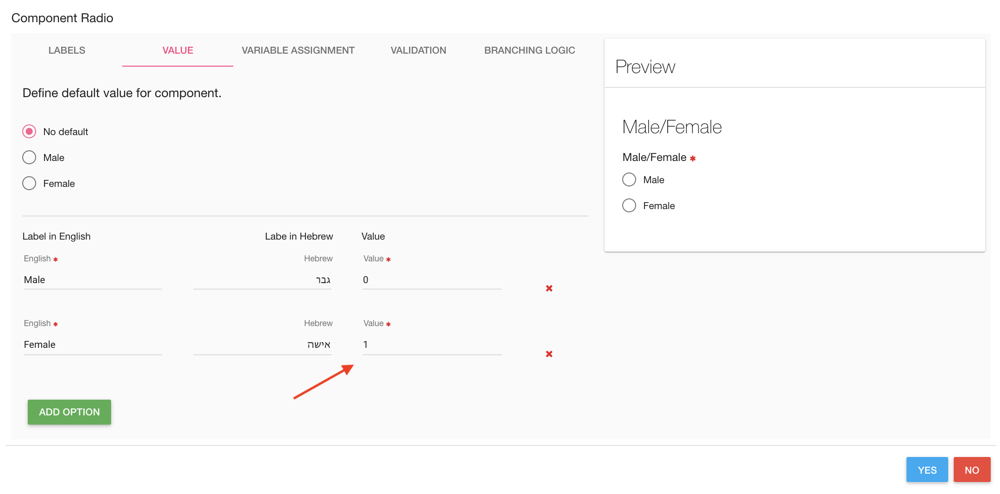
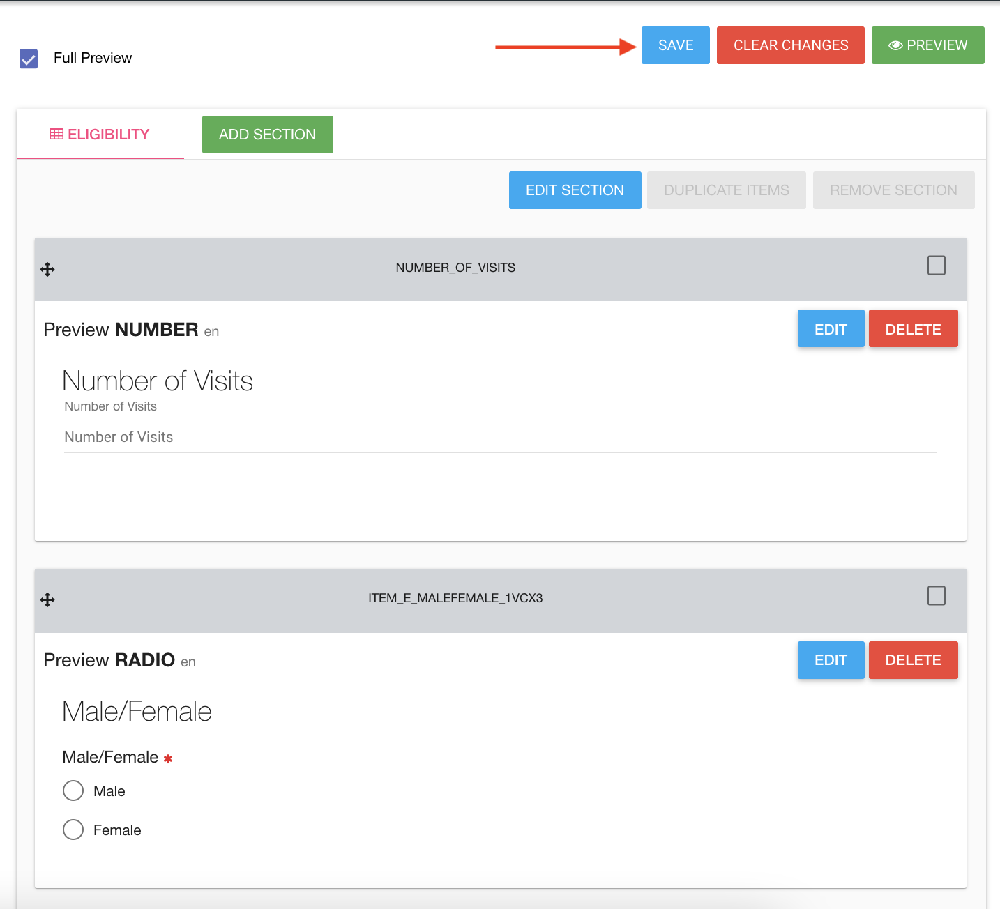
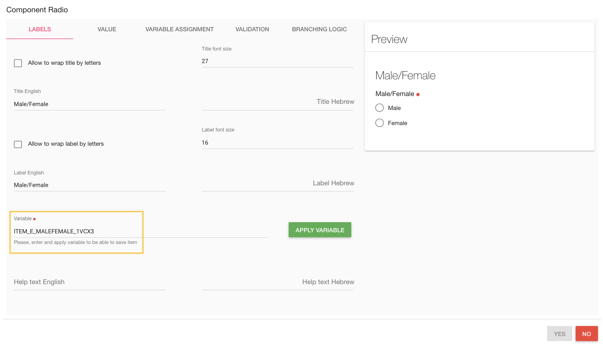

#Manage Forms
In the left menu bar, click on **FORMS**.

##What is Flask Forms?
* Flask Forms is an online eSource app.
* Forms features unlimited subjects, forms, and data.
* You can create the eCRFs yourself using a super friendly interface.  
* Includes a library of ready-to-go eCRF templates.
* Runs on desktops, notebooks, tablets, and phones.

##Build your eSource app
On the Forms page, you can define the study's CRFs, Events, Pro, and Alert rules.

###CRFS
In order to create a new CRF click on the **ADD CRF** green button

####CRF Properties
In CRF card you need to define the CRF properties (You can also edit it after saving).
* Queries status - Turn on/off CRF queries option (See [manage queries](./manage_queries.md#manage-queries)).

  When CRF queries are turned on - each item in the CRF has query dialog - add queries by click on the question mark.

  

* Layout - There are several layouts of CRFs:
    - Default (question after question vertically)
    - Grid
    - Cards on grid
* Columns - If the layout is grid or Cards, on grid choose the number of fields in each row.
* Name - CRF name
* Description - CRF Description

Click **YES** to create this CRF

#####Layout examples:

* Default layout

* Grid layout

* Cards on grid layout

####CRF Sections
In Section card define CRF's section, you can also edit it after saving.
!!!note
    One CRF can include more than one section

* Name
* Description

You can add sections to CRF by click on the **ADD SECTION** button

####CRF Items
You can define items in each CRF.
By click on component, the component is added to the CRF (at the end of the list)

After adding an item, you should define the new item properties by click on the **EDIT** option. 

#####Edit CRF Item
By click on the **EDIT** button of item, an Edit card is opened.

######Labels
In the first tab **LABELS**, you should define the item's name, description, etc.

######Value
The second tab is **VALUE**, you can set a default value to this item. 

######Variable Assignment

The third tab VARIABLE ASSIGNMENT, is used to assign values to a Form item. 

You can assign variables, computed expressions or data from an external API call.

Autocomplete:
Forms variable assignment provides an autocomplete feature. Just type '$' and select the variable(s)
you want in your expression.

Let's see a couple of examples-

Simple variable assignment:
To assign a variable from another Form - just type:
$cat = $cat_in_the_hat

Computed variable assignment:
To assign a computation based on several Form variables - try this:

$force = $mass * $acceleration

Populating a form from an external API:
To populate a Form item from an external API call, you can use the get() function.
You can write calls like:

get()   - this calls the external_data_source specified in the Customer Profile>Customer MetaData
get(/auth/self)[first_name] + ' ' + $CAT_HAIR_COLOR - Pass a variable value from the form
get(/some/endpoint) - just call an endpoint
get(/some/endpoint?first=with&second=query&third=params) - call an endpoint with a query string

Item data types:
For an INPUT or DATE field - the API must return a single value.

For a SELECT box field - the API must return a JSON object like {"blond": 1, "brunette": 2}.
This will populate a select box with 2 options - Blond and Brunette with values 1 and 2 respectively.

Configuring External API services:
Click on the hamburger icon > Customer Profile > Customer MetaData
To set a default URL for the external API - set external_data_source like this:
external_data_source	https://my-api.service.com My API

To access a service with oAuth authentication - -  provide external_data_source_config_key and the external_data_source_authentication_method key-value pairs like in this example:
external_data_source_config_key	flask	Flask source key
external_data_source_authentication_method	oAuth	external data source authentication method

Testing:
The TEST button enables you to preview the results of the variable assignment.

<iframe width="560" height="315" src="https://www.youtube.com/embed/ZDAzjUgpbds" title="YouTube video player" frameborder="0" allow="accelerometer; autoplay; clipboard-write; encrypted-media; gyroscope; picture-in-picture" allowfullscreen></iframe>

######Validations
The fourth tab is **Validation**, each component has another validation options.

For example - number component has the following validation tab:

Required, Disabled, and Confirm parameters exist in each component.

* Required - Check it if this item is a mandatory.
* Disabled - Check it if this item is disabled - the user cannot change/edit it
* Confirm - This item popup a confirm dialog card.

######Branching Logic
The fifth tab is the **Branching Logic**. In this tab you can write simple logic for the item.

!!!quote

    Branching logic expression for this item:

    To use the autocomplete service,
    type "$" and select the variable of interest for you.
    Use variables to make expression for hide current form control.
    The terminal supports any JavaScript expressions for the value of the available form variables.

    For example:
    $ITEM_IMPORTANT_VAR == 'string_var_value'

For example - Show/Hide method

Item that depends on another item.

A radio button item has 2 options - Male or Female (required question)

If user check female -> Another item 'Number of children' is opened.

To do this, you need to create the basic item (male/female) first,

Then save it by click on the **SAVE** button at the top of the page.

Using the save option, the system generates variables to the CRF items, which you can use for branching logic.

After you saved items in the CRF, you can add branching logic to the 'Number of children' item,

Go to Hide/Show item branching logic and write your logic.

!!!note
    In branching logic that related to checkbox item, the branching logic should be like
    `$CHECKBOX_ITEM_NAME == true`

####CRF Actions
There are a few available actions for each CRF.

In CRFS tab there is a blue **ACTIONS** button with the following options:

* PREVIEW - By a click on the **PREVIEW** option, a new window is opened with this CRF layout
* Edit CRF - Edit [CRF Properties](#crf-properties)
* Edit ITEMS - Edit [CRF Items](#crf-items)
* DUPLICATE CRF - By click on this option a new duplicate CRF is created (with the same properties, sections, and items)
  * Notice: The CRF OID and items' variable are different.
* DELETE - Deletes this CRF

####Export CSV
There is a green **EXPORT CSV** button.

By click on this button, you download a zip folder with all of the CRF data.

There is one CSV file created for each CRF.

###Event Definitions
In order to manage study events, click on the **EVENT DEFINITIONS** tab.

Create an event by clicking on the green **ADD EVENT DEFINITION** button.

There are a few properties of event:

* Name - the display name of this event
* Attached CRF list - CRFs in this event.
    
    * Click the green **ADD CRF** button to add a CRF in this event
    * Click on the **one more time** option in this event's CRF to add additional this CRF in this event
    * The **Render 'Finish' on last form only** button will appear on the last CRF of this event (instead of appear in each CRF - by default)
* Attached Rules list, you can create rules and add them to this event.
  Event rules generate an error when the CRC saves the event with an error.
  * When users try to save the last CRF inside of the event, this rule will be checked, and user will get an error if this expression returns false.

Click on the blue **SAVE** button to save your changes, OR the **BACK TO LIST**/**CLEAR CHANGES** buttons to undo your changes.

####Event Definition Actions
There are a few available actions for each Event.

* Edit event definition - to edit this event (add CRF, delete CRF, etc.)
* Delete - Delete this event.

###Study Schedules
This tab is related to study PRO.

If your study has PRO for [patients](./manage_subjects.md#manage-subjects)

To define PRO(s) for a study, you need to create a study schedule.

There are a few definitions of a study schedule:

* Name - Name of this Study Schedule
* Periods - Study periods, Add periods by click on the blue **ADD PERIOD** button
    * Period Length - Period length (in days)
    * Name - the name of this period
    * Description - description of this period
    * Allow expanding this period - continue this period until another period begin to the subject, OR until study has been completed (study completion date value).
    * For [randomized subjects](./manage_subjects.md#randomize) - Begin this period for randomized subject (CRC should define it to each subject)
    * Event Definitions - Define the [event](#event-definitions) to this period PRO
         Click on Event Definitions, the Event Definitions list will be opened, and choose one event.
         
         Click on the green **ADD EVENT DEFINITIONS** button 
         !!! note
            You are able add multiple events.

         The selected event will be added to the list with scheduled times and scheduled days.

         * **Scheduled time** You can choose the available time of this event to PRO of subject.
         * **Scheduled days** You can choose the days of this PRO event.

         By default, scheduled time is 10:00 and scheduled days are all the days of week.

Save your study schedule by click on the **SAVE** button.

###Metrics Definitions
See [Metrics Definitions](metrics.md#alert-definitions)

###Languages
You can switch between languages by click on the languages tab and selecting the desired language.

###Studies
Using the last option in the top bar, you can switch between your studies and manage forms to each one of them (in the case that you have several studies).

###Hamburger
The last item in the top bar is the "Hamburger"

By hovering with the mouse on the hamburger a list of options opens.

* **Signed in as** - The login user (It's you :smile: )
* **Database Audit Log** - Open the data audit log (create/update/delete CRF/Events/Data etc.)

    

* **Restore Study CRFs** - Put backup of study CRFs and restore it here, in the current study.
    

    !!! note ""

        Restore study CRFs restores json file.

* **Create a dump of study CRFs** Create a backup of this study's CRFs.
    

    **NOTE** - You can create a dump includes/excludes events definitions, and you can dump a few CRFs you choose.

    This option downloads CRFsDump.zip folder includes json file. Extract the file to restore it.

* **Logout** - Logout from FlaskData

!!! note "Return to FlaskData App"

    To return to flask application click on FlaskData logo

    
