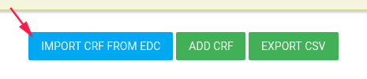

#Manage Forms
In the left menu bar click on FORMS.

##What is Flask Forms?
* Flask Forms is an online eSource app
* Forms features unlimited subjects, forms and data. 
* You can create the eCRFs yourself using a super friendly interface.  
* Includes a library of ready-to-go eCRF templates.
* Runs on desktops, notebooks, tablets and phones.

##Build your eSource app
In Forms page you can define the study's CRFs, Events , Pro and Alert rules.

###CRFS
In order to create a new CRF click on **ADD CRF** green button

####CRF Properties
In CRF card you need to define the CRF properties (You can also edit it after the saving).
* Queries status - Turn on/off CRF queries option (See [manage queries](./manage_queries.md#manage-queries)).
  
  When CRF queries is Turn on - each item in this CRF has queries dialog - add query by click on the question mark.
  
  
  
* Layout - Layout of CRF, There are several layouts:
    - Default (question after question vertically) 
    - Grid
    - Cards on grid
* Columns - If the layout is grid or Cards on grid choose the number of fields in each row.
* Name - CRF name
* Description - CRF Description

Click **YES** to create this CRF

#####Layout examples:

* Default layout

* Grid layout

* Cards on grid layout

####CRF Sections
In Section card define CRF's section, You can also edit it after the saving.
 (One CRF can include more than one section)
 
* Name
* Description

You can add sections to CRF by click on **ADD SECTION** button

####CRF Items
You can define items in each CRF.
By click on component the component is added to the CRF (in the end of the list)

 

After adding item you should define the new item properties by click on **EDIT** option

#####Edit CRF Item
By click on **EDIT** button of item an Edit card is opened.

######Labels
In the first tab **LABELS** you should define item's name, description etc.

######Value
Second tab is **VALUE** you can set a default value to this item

######Validations
The third tab is **Validation**, each component has another validation options.

For example - number component has the following validation tab:

Required, Disabled and Confirm parameters exist in each component.

* Required - Check it if this item is a mandatory.
* Disabled - Check it if this item is disabled - the user cannot change/edit it
* Confirm - This item popup a confirm dialog card.

######Branching Logic
The fourth tab is the **Branching Logic**, In this tab you can write a simple logic for this item.

!!!quote

    Branching logic expression for this item
    To use the autocomplete service, 
    type "$" and select the variable of interest for you. 
    Use variables to make expression for hide current form control.
    The terminal supports any JavaScript expressions for the value of the available form variables. 
    For example:
    $ITEM_IMPORTANT_VAR == 'string_var_value'

For example - Show/Hide method.
Item that depends on another item.

A radio button item has 2 options - Man or Female (required question)

If user check female -> Another item 'Number of children' is opened.

For do it - you need to create the basic item (man/female) first,
 
Then save it by click on **SAVE** button in the top of the page.
 

By save option the system generates variables to the CRF items, and you can use them for the branching logic.

After you saved items CRF you can add branching logic to 'Number of children' item,

Go to Hide/Show item branching logic and write your logic.

####CRF Actions
There are a few available actions for each CRF.

In CRFS tab there is an **ACTIONS** blue button with the following options:

* PREVIEW - By a click on **PREVIEW** option - a new window is opened with this CRF layout
* Edit CRF - Edit [CRF Properties](#crf-properties)
* Edit ITEMS - Edit [CRF Items](#crf-items)
* DUPLICATE CRF - By click on this option a new CRF is created same as this CRF (with the same properties, sections and items)
  * Notice: The CRF OID and items' variable are different.
* DELETE - Delete this CRF

####Export CSV
There is **EXPORT CSV** green button.

By click on this button you download a zip folder with all CRF data.

One CSV file for each CRF.

###Event Definitions
In order to manage study events, click on **EVENT DEFINITIONS** tab.

Create event by click on **ADD EVENT DEFINITION** green button

There are a few properties of event:

* Name - the display name of this event
* Attached CRF list - CRFs in this event.
    
    * **ADD CRF** green button to add CRF in this event
    * **one more time** add option in this event's CRF to add additional this CRF in this event
    * **Render 'Finish' on last form only** Finish button will be appeared in the last CRF of this event (instead of appear in each CRF - by default)
* Attached Rules list, You can create rules and add them to this event.
  Event rule generates an error when CRC save the event with error.
  * When user try to save the last CRF inside the event this rule will be checked and user will get an error if this expression returns false.
  

Click **SAVE** blue button to save your changes OR **BACK TO LIST**/**CLEAR CHANGES** to unsave your changes.

####Event Definition Actions
There are a few available actions for each Event.

* Edit event definition - to edit this event (add CRF, delete CRF etc.)
* Delete - Delete this event.

###Study Schedules
This tab is related to study PRO.

If your study has PRO for [patients](./manage_subjects.md#manage-subjects)

To define PRO/s for study you need to create study schedule

There are a few definitions of study schedule:

* Name - Name of this Study Schedule
* Periods - Study periods, Add periods by click on **ADD PERIOD** blue button
    * Period Length - Period length in days
    * Name - the name of this period
    * Description - description of this period
    * Allow expanding this period - continue this period until another period begin to the subject.
    * For randomized subjects - Begin this period for randomized subject (CRC should define it to each subject)
    * Event Definitions - Define the [event](#event-definitions) to this period PRO
         Click on Event Definitions, Event Definitions list will be opened, choose one event.
         
         Click on **ADD EVENT DEFINITIONS** green button (You can add a few events).
         
         The selected event will be added to the list with Scheduled time and Scheduled days.
         
         * **Scheduled time** You can choose the time of available this event to PRO of subject
         * **Scheduled days** You can choose the days of this PRO event.
         
         By default, Scheduled time is 10:00 and Scheduled days are all the days of week.
         
Save you Study Schedule by click on **SAVE** button
    
###Alert Definitions
See [Alert Definitions](manage_alerts_definitions.md#alert-definitions)

###Languages
You can switch between languages by click on Languages tab and select the desired language.

###Studies
In the last option in the top bar you can switch between your studies and manage forms to each one of them.
(In case you have several studies).

###Hamburger
The last item in the top bar is the "Hamburger"

By standing with the mouse on the hamburger a list of options opens.

* **Signed in as** - The login user (It's you :smile: )
* **Study Alerts** - Open [study alerts list](manage_alerts_definitions.md#study-alerts)
* **Database Audit Log** - Open the data audit log (create/update/delete CRF/Events/Data etc.)

    

* **Restore Study CRFs** - Put backup of study CRFs and restore it here (in the current study)
    
    
    !!! note "" 
        
        Restore study CRFs restores json file.
    
* **Create a dump of study CRFs** Create a backup of this study's CRFs.
    
    
    **NOTE** - You can create a dump includes/excludes events definitions, You can dump a few CRFs you choose.
    
    This option downloads CRFsDump.zip folder includes json file. Extract the file to restore it.
    
* **Logout** - Logout from FlaskData

!!! note "Return to FlaskData App" 
 
    to return to flask application click on FlaskData logo

    
    
##Relationship between EDC and Forms
If your study uses [ClinCapture Database](./manage_studies.md#add-study) you can connect the two.

###import/export CRFs and Events
####Import CRF From EDC
You can import CRF From EDC to Forms by click on **IMPORT CRF FROM EDC** blue button

CRF list opens, You can import each CRF you need.

After you imported, you can [edit the CRF](./manage_forms.md#edit-crf-item).

Now - You have CRF in Forms related to EDC CRF.

Each CRF data you enter or edit for specific subject in Forms will update the EDC CRF data.

For detach the CRF from EDC CRF, Go to CRF list **ACTIONS**->**DETACH CRF**

 
 
###Export CRF to EDC
You can export CRF to EDC by click on **ACTIONS**->**EXPORT** option

 
 
 !!!example
 
     Study uses Flask PRO and EDC DB, You can export study PRO CRFs to EDC.
     
     When subject inserts data in ePRO the data is inserted into EDC as well.
 

