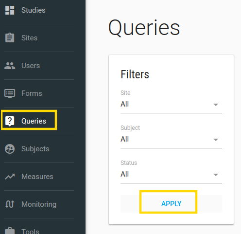
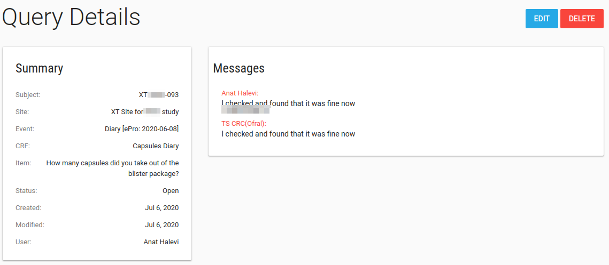
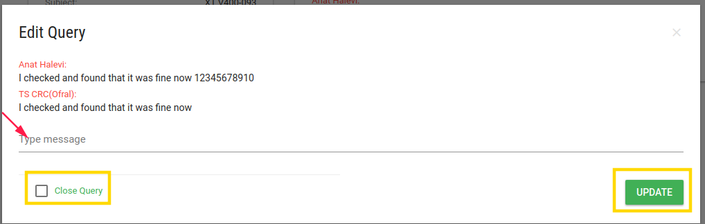

#Manage Queries
On the left menu bar, click on Queries.
On this page - Queries index, you can see all queries data of this study.

You can filter Queries by sites, subject, or status then click **APPLY**

You can click on each query row to see query properties, add your comment, close the query, or delete it.

##Query Details

Query Details page includes Summary/Messages cards and Edit/Delete buttons.

##Query Edit
By click on the blue **EDIT** button a discussion card opens.

You can close the query or add your message.

You can click on each query row to see query properties, add your comment, close the query, or delete it.

