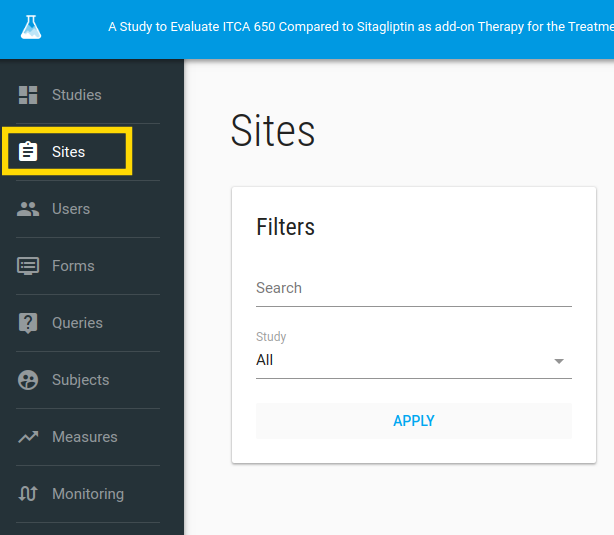
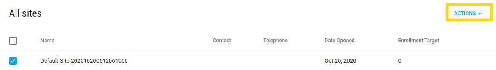
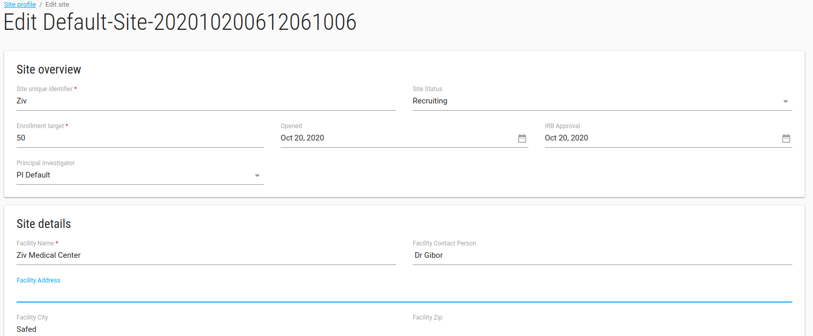
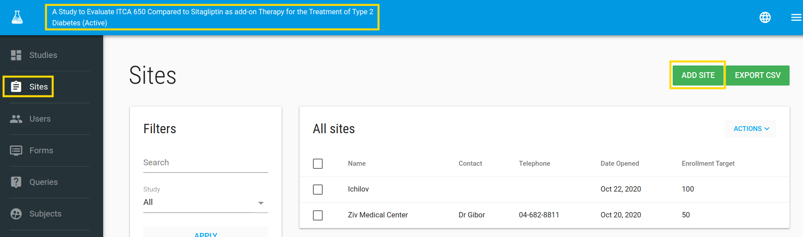

#Manage Sites
In order to manage research sites, click on **Sites** in the left bar.

##Default site
By default, you have one site assigned to your study, called `Default-Site-XXX`

Edit the default site by **ACTIONS**-> **EDIT**

##Edit Site

In the Edit option you can edit your site properties.

Click **SAVE** green button to save your site properties.

##Site Profile
In Site Profile you can see your site's definition, add comments, and mange this site's Users by click on **ACTIONS**->**Manage Users**

###Mange Users
In Site Manage Users you can remove/add existing User to this site (if you don't have the User, go to [create it](./manage_users.md#add-user))

You can add a User by typing any part of his name - the application will show you a list of matching User names.

Click on invite green button 

Now you have a site with Users (like - CRC, PI) in your study.

##Add a new site
In the Sites index page you can add new sites to your study.
To add site click on **ADD SITE** button

Enter the site properties and save it by click on **SAVE** green button.
