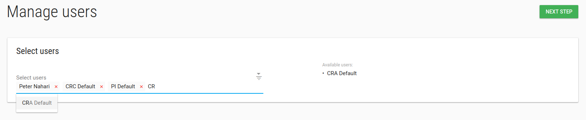
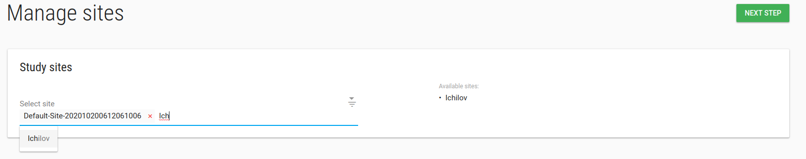
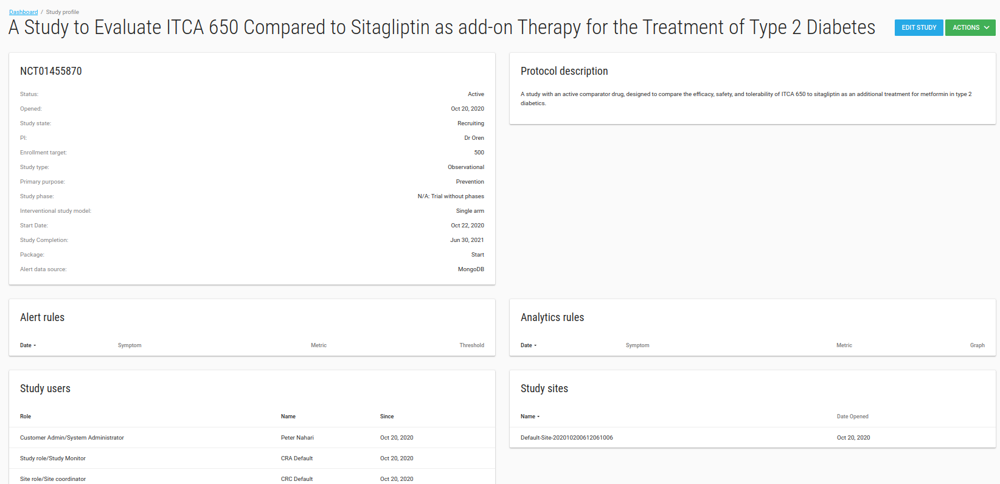

#Studies
You can run a few studies in parallel.
You can add/edit your studies properties, users, sites etc.

##Add study
To add studies go to studies index page by clicking on studies in the left bar.
Click on **ADD STUDY** green button.

Fill your study properties and click **SAVE** mange users page will be opened.

---
**NOTES:**

1. *Database* and *EDC URL* fields are related to EDC db, if you have EDC (clin capture) db you should fill them.
2. *Enable patient reported outcome module?* Check this checkbox if your study has a PRO for patients.
3. *PRO URL*: If study has another PRO then FlaskData fill the *PRO URL* field with your study's PRO URL.
4. *Package*: There are 3 available packages, Start, Submit and Validate.
    * Start - study uses IRB and Forms
    * Submit - Flask+Forms+Tools+EDC. Unlimited sites.
    * Validate - Flask+Forms+Tools+EDC. Limited to 3 sites.
5. *Alert data source*: Data for alert definitions (If study uses clinCapture you should choose PostgreSQL otherwise choose MongoDB).
---

##Study manage users
In manage users page you can add/remove user from this study.

To add a new user to the study - you need to [create the user](./manage_users.md#add-user) first.

Type any part of the user's name in the Select users box and choose the relevant user.

Click **NEXT STEP**, Welcome emails will be sent to users' emails.

Manage sites page will be opened.

##Study manage sites
In manage sites page you can add/remove site from this study.

To add a new site to study - you need [create the site](./manage_sites.md#add-a-new-site) first.

Type any part of the site's name in the Select sites box and choose the relevant site.

Click **NEXT STEP**

##Study Edit
In studies index page you have option to edit your study.

To edit the study - check it and then click on **ACTIONS** green button and choose the **Edit** option.

 
 In edit study window you can define your study profile, definitions etc.
 
---
**NOTES:**

1. *Study subject prefix*: Prefix of creation subject label, like study1-001.
2. *Subject’s IDPs settings*: IDP settings for subjects-patients.
___

When you click **SAVE** the profile study will be opened.

##Study Profile
In study profile page you can see your study's definitions, alert rules, analytic rules, users, sites and comments.

  

There is a **Comments** card that you can write all your comments about your study.

There is an **ACTIONS** green button with manage users and manage sites options.
