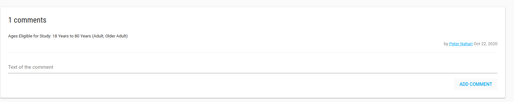

<a href="https://www.flaskdata.io"></a>

#Studies
You can manage all of your studies on Flask.

You can add and edit your Study properties, assign Users, assign Sites, and more.

##Add study
To add a new Study, go to the studies index page by clicking on Studies in the left side-bar.
Click on the green **ADD STUDY** button.


Fill in your study properties and click **SAVE**. The Manage Users page will open.

!!! note "Study values"

    1. *Database* and *EDC URL* fields are related to EDC db, if you have EDC (clinCapture) db you should fill them in.
    2. *Enable patient reported outcome module?* Check this checkbox if your study has a PRO for patients.
    3. *PRO URL*: If study has another PRO then FlaskData fill the *PRO URL* field with your study's PRO URL.
    4. *Package*: There are 3 available packages; Start, Submit and Validate.
        * Start - study uses IRB and Forms
        * Submit - Flask+Forms+Tools+EDC. Unlimited sites.
        * Validate - Flask+Forms+Tools+EDC. Limited to 3 sites.
    5. *Alert data source*: Data for alert definitions (If study uses clinCapture you should choose PostgreSQL, otherwise choose MongoDB).

##Study manage Users
Study Role users get assignmed studies from the customer admin and can only access studies, queries, and subjects. Study Role users can add comments and subscribe to alerts. If given permission, they can also be form designers.

In the manage Users page you can add/remove User from this study.

To add a new User to the study - you need to [create the User](./manage_users.md#add-user) first.

Type any part of the User's name in the Select Users box and choose the relevant User.


Click **NEXT STEP**, and welcome emails will be sent to Users' emails.

The Manage Sites page will be opened.

##Study manage sites
In manage sites page you can add/remove site from this study.

To add a new site to your study, click on [Create Site](./manage_sites.md#add-a-new-site) first.


Type any part of the site name in the Select sites box and pick the site you want to add to your study.

Click **NEXT STEP**

##Study Edit
In the Studies index page you can edit your study.

To edit your study - check it, click on the green **ACTIONS** button, and choose the **Edit** option.


In the Edit Study page you can define your study profile, definitions, etc.

!!! note

    1. [Study subject prefix](./manage_features.md#subject-label-calculation): Prefix for automatically creating a subject label, like study1-001.
    2. [Subject’s IDPs settings](./manage_features.md#idp-configuration): IDP settings for subjects-patients.

When you click **SAVE** the Study Profile will be opened.

###Archived studies
To mark study as Archived you need to change its status to **Close**.

!!!danger 

    Archived studies cannot be modified!!

Studies with a Closed status, you have the ability to view their data, but cannot change data, add subject, etc. They are inactive studies.

If you mark study status as closed, the study will be marked as **Archived**, and you cannot see it in the studies list.

But don't worry, go to the studies index page and filter studies with **Archived only**. Now you can view the study, but cannot change it.


##Study Profile
In the Study Profile page you can see your study's definitions, alert rules, analytic rules, Users, Sites and comments.


There is a **Comments** card that you can write all free text comments about your study.



There is an **ACTIONS** green button with Manage Users and Manage Sites options.

##Access Control Lists 
ACL utilities:

1. Users can create study roles

2. Users can assign each event definitions to a study role

3. Users can assign each user to a study role

4. Manage research roles are available to customer admin and form designer users

<iframe width="560" height="315" src="https://www.youtube.com/embed/caPqj0Pwiy0" title="YouTube video player" frameborder="0" allow="accelerometer; autoplay; clipboard-write; encrypted-media; gyroscope; picture-in-picture" allowfullscreen></iframe>


###Study Metadata
In study profile there is a **Study Metadata** card.

In this table customer admin user can add/edit/delete free text meta-data strings describing your study. 

For example, you can use Study MetaData to store the URL of a mobile app.


!!!note "Extract study_metadata by API"

    You can get this table data from the [generic API](./apiflows.md#flaskcustomerextract-data-to-json).
    
    Body request should be something like:
    
    ```json
        {
          "tableName": "study_metadata",
          "fromDate": "2018-03-29T11:44:12.511Z",
          "toDate": "2020-12-29T11:44:12.511Z"
        }
    ```