
#Manage Subjects
In the left menu bar click on Subjects.

On this page - Subjects index you can see study subjects and their CRFs data.

You can filter Subjects by site, or other specifications using **Search** filter and clicking **APPLY**.

You can click on each subject and go to Flask Events.

##Flask Events
On the flask events page you see all of the subject's events, CRFs and data.

!!! note

    You can only view the data (cannot edit or add CRFs).
    Only site role users can edit Subject's data.

You can see all subject's events list.

By clicking on an event, a list of this event's CRFs opens.

You can view the data by click on the subject.

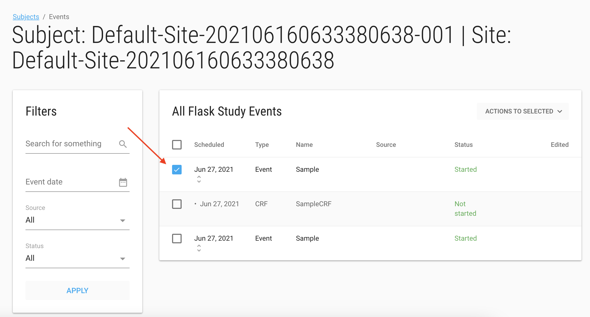

You can now input into the CRF. This data is displayed, however entered data is not saved. 

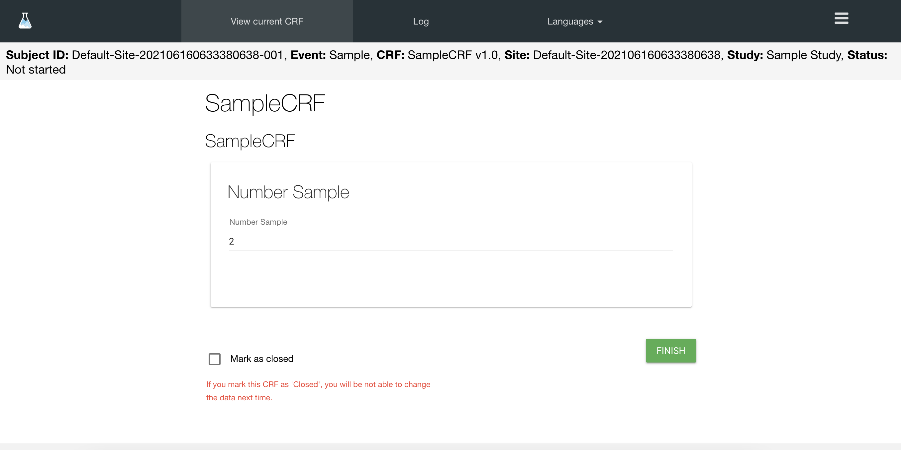

The customer admin user has permissions to re-open the closed CRFs.

##Add Subject
Site role user can add subject on their site.

Click on the green **ADD SUBJECT** button to add a new subject 

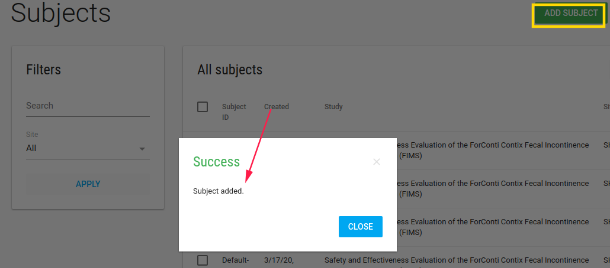

If the study has ePRO, CRC should define the subject's email and phone number.

<iframe width="560" height="315" src="https://www.youtube.com/embed/NVOpTfqu-eQ" title="YouTube video player" frameborder="0" allow="accelerometer; autoplay; clipboard-write; encrypted-media; gyroscope; picture-in-picture" allowfullscreen></iframe>

On the subjects index page there is a blue **Actions** button with Edit and Profile options.

By check a subject and Edit/Profile you open the Profile page.

##Subject Profile
In Subject Profile page, site role user can edit subject's data by clicking on the pen.

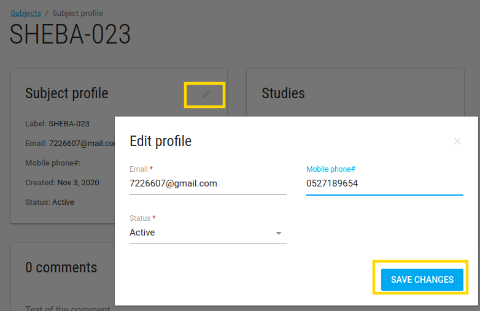

* Email - The email of this subject
* Mobile phone - The phone number of this subject
* Status - The status of this subject

There are Studies, Sites and comments cards of this subject.

###Actions
On the subject profile page, there is a green **ACTIONS** button with the following options:

* Welcome back - This option appears if study has PRO.
* Reset password - This option sends an email with a reset password required link.

##Subject Events
By clicking on subject on the Subjects Index page, the Flask Events page opens.

In this page site role user can [create events, add CRFs, enter data, deactivate CRF, etc.](./manage_data.md#create-event-by-crf)

###Send Message
To navigate to the send message feature, the site role user should locate the Subject Flask-Events page.

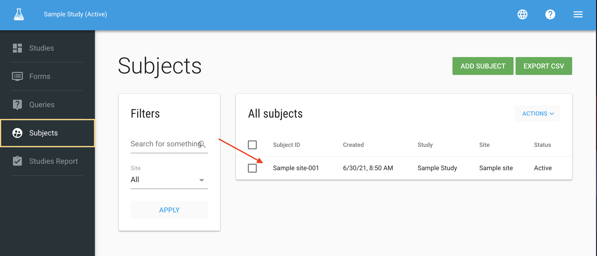

After selecting a subject, there is a blue **SEND MESSAGE** button.

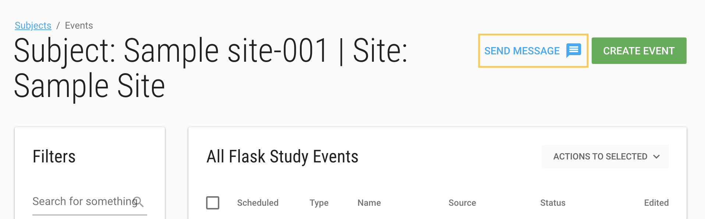{: style="height:400px;width:700px"}

Clicking on this button open a page with option to send Email/SMS to the subject.

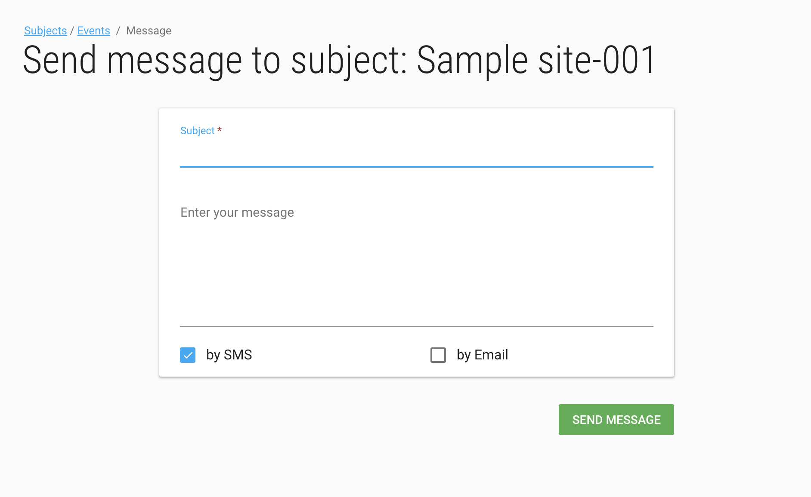{: style="height:460px;width:700px"}

###Randomize
If a study has PRO with [Randomized option](./manage_forms.md#study-schedules)

An additional check box will appear - **RANDOMIZED**

In **Study Schedule by period** you should define the start period and choose the period for this subject. If this is used for randomized subjects, check the box.

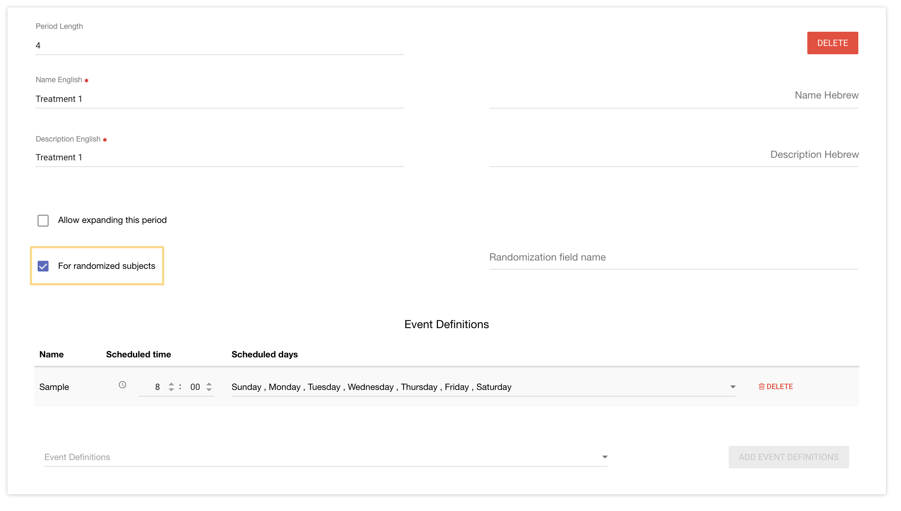

##Forget Subject

Super Admin can define a Customer Admin user as a "DPO user". 

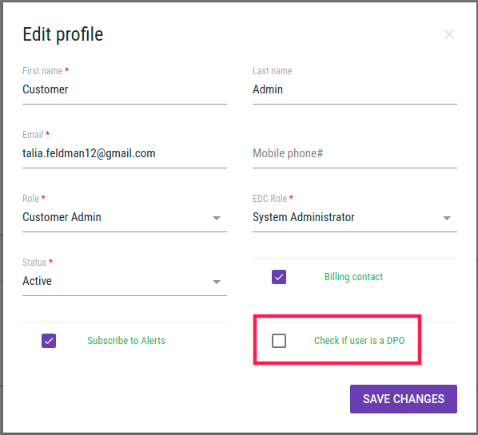

This will generate a PIN that the DPO users can use to delete a subject using the forget option.

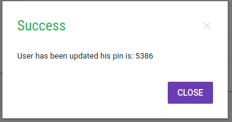

To forget a subject, navigate to your study subjects using the left bar. Next check the subject you want to forget and click on the blue pull down **Action** button and select forget. A verification message will pop up.

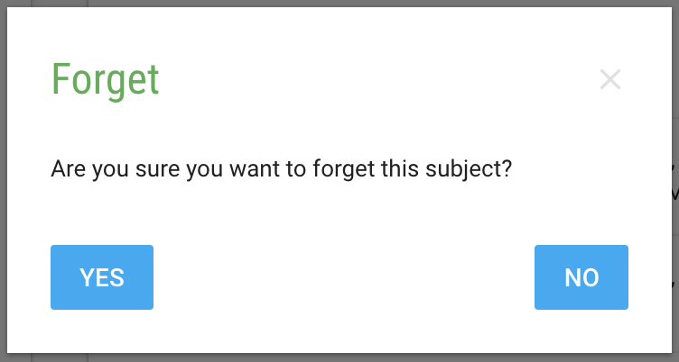{: style="height:200px;width:400px"}

After you select yes, you will be prompted to enter the PIN.

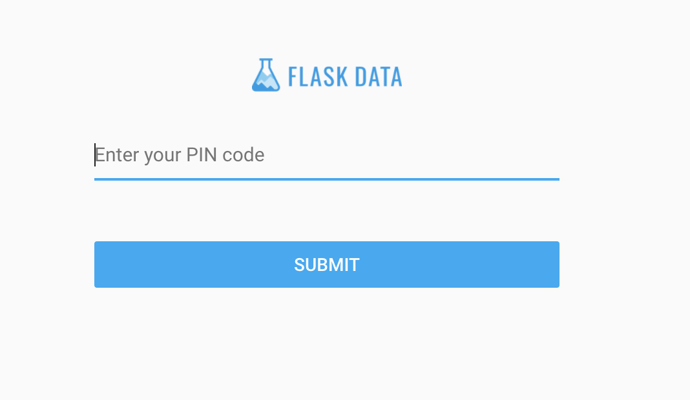{: style="height:300px;width:450px"}

Lastly, you will see the success message. 

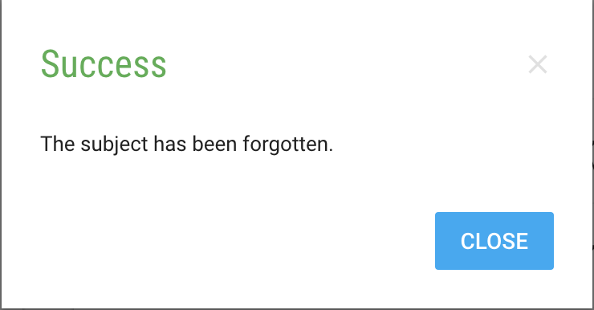{: style="height:200px;width:400px"}
