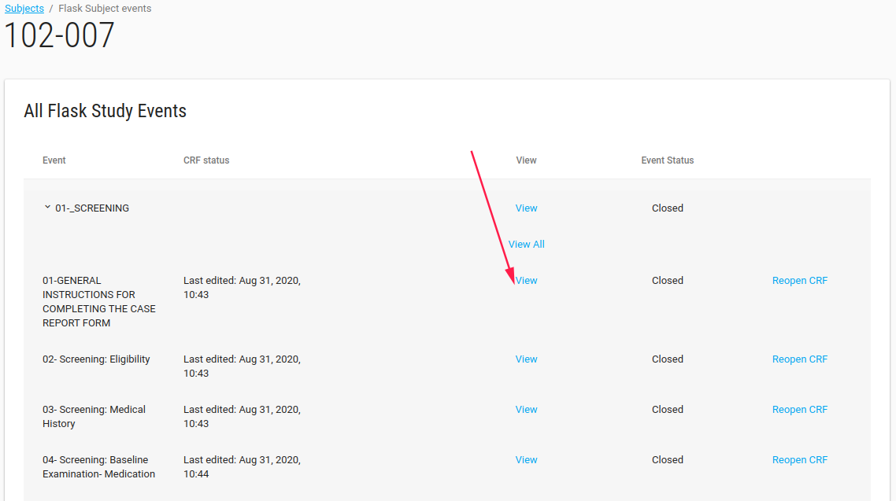
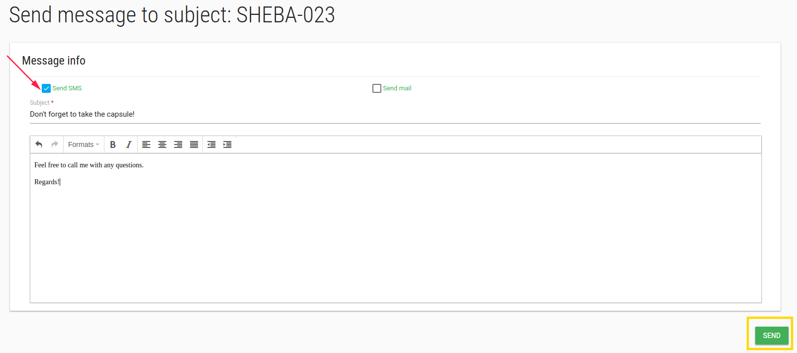
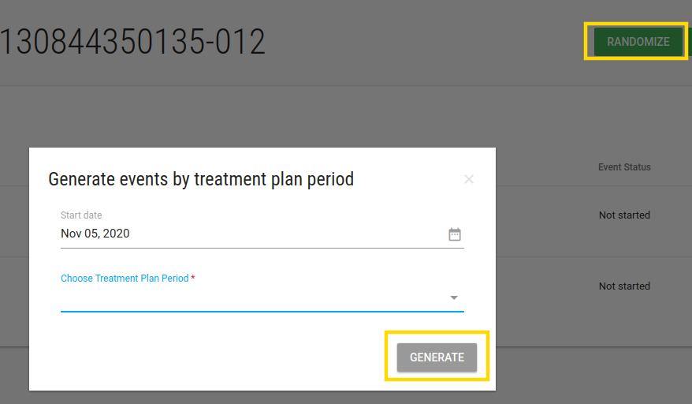

#Manage Subjects
In the left menu bar click on Subjects.
In this page - Subjects index you can see study subjects and their CRFs data.

You can filter Subjects by site, or what you want by the **Search** filter and then click **APPLY**

You can click on each subject and go to Flask Events

##Flask Events
In flask events page you see al subject's events, crfs and data.

!!! note

    You can just view the data (cannot edit and add CRFs).
    Just site role users can edit Subject's data.

You can see all subject's events list.

By click on event - list of this event CRFs opens.

You can view the data by click on **View** option.

Customer admin user has permissions to re-open the closed CRFs.

##Add Subject
Site role user can add subject on his/her site.

Click on **ADD SUBJECT** green button adds a new subject 

If study has ePRO, CRC should define subject's email and phone number

<iframe style="width: 100%;height: 450px;" src="https://www.youtube.com/embed/cvTWk8Bjtl8?rel=0&amp;showinfo=0" frameborder="0" allowfullscreen></iframe>

In Subjects index page there is **Actions** blue button with Edit and Profile options.

By check a subject and click Edit/Profile you open Profile page.

##Subject Profile
In Subject Profile page site role user can edit subject's data by click on the pen.

* Email - The email of this subject
* Mobile phone - Phone number
* Status - The status of this subject

There are Studies, Sites and comments cards of this subject.

###Actions
In subject profile page there is an **ACTIONS** green button with a few options:

* Welcome back - This option appears if study has PRO.
* Reset password - send email with reset password require.

##Subject Events
By click on subject in Subjects Index page, the Flask Events page opens.

In this page site role user can [create events, add CRFs, Enter data, Deactivate CRF etc.](./manage_data.md#create-event-by-crf)

###Send Message
In subject's Flask Events page there is **SEND MESSAGE** green button.

Click on this button open a page with option to send Email/SMS to subject.

###Randomize
If study has PRO with [Randomized option](./manage_forms.md#study-schedules)

An additional button will appear - **RANDOMIZED**

In **Generate events by treatment plan period** you should define the start period and choose the period for this subject.

