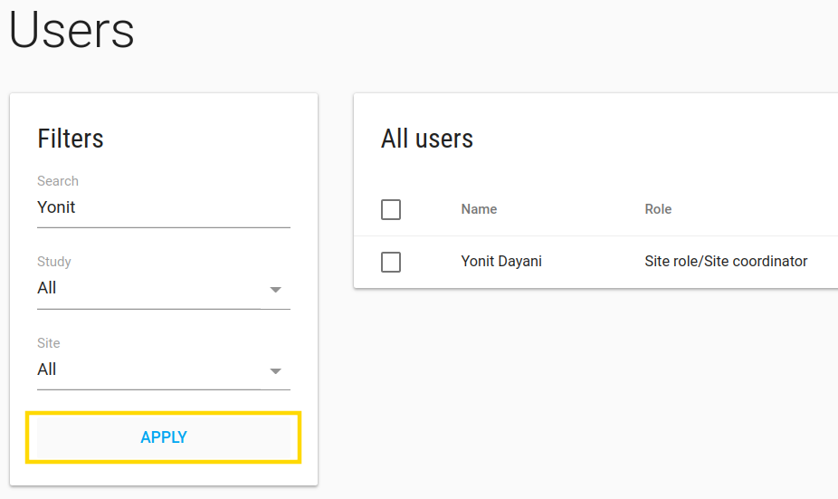
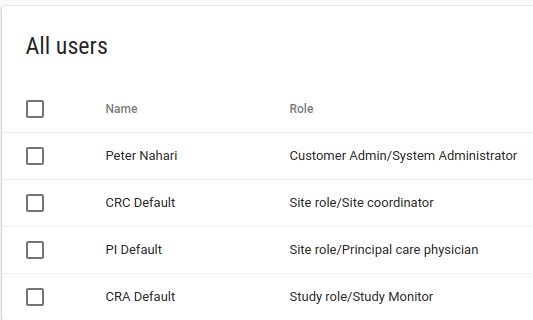
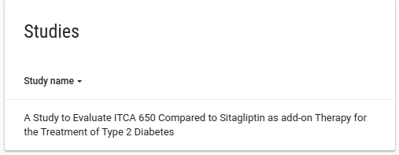
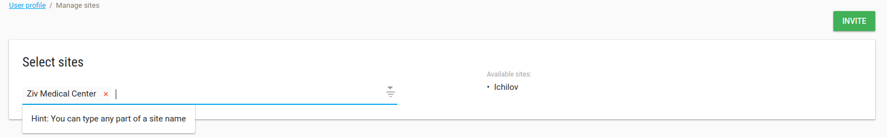
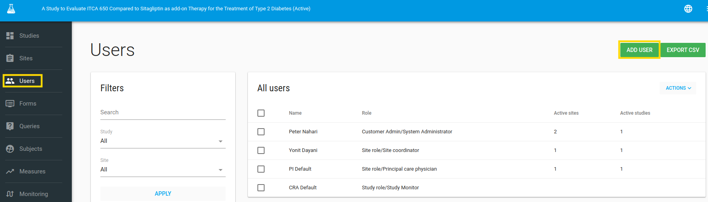

#Manage Users
In the left bar click on users.
In this page - Users index you can add users to your study, edit users, assign user to site etc.

You can filter users by study, site or what you want by the **Search** filter and then click **APPLY**

##Default users
By default, you have 4 users assigned to your study:

    1.Customer admin user - This is your user!
    2.CRC Default - CRF user
    3.PI Default - PI user
    4.CRA Default - CRA user

**Each default user has another permissions.**

##Edit User
Edit the default users to your right users one by one, by **ACTIONS**-> **EDIT** option

###Profile
In user profile page there is a pen in the right corner of **Profile card**, click on it and edit user's properties.

After you change user's email you can send him/her an email to create password by a click on **Send create password**

You don't have to do it - your users can log in with their Google account.

---
**NOTES:**
In edit user profile action you can change a few user's parameters

1. *Role* There are 3 roles 
    * Customer Admin - user has all customer permissions - add/edit studis, users, sites, alerts and etc.
    * Study Role - user has study permissions - to see all study data (of all the sites)
    * Site Role - user has site level permissions - to see his site data, add subject to his site, create events and crfs to subject.  
2. *Form designer*: define if user has Forms permissions - add/edit/delete Events and CRFs from the system (by default only customer admin users can do it).
3. *Subscribe to Alerts*: define if ths user will get alerts from this study (according to alert rules).
---

###Studies
In **Studies card** you can see the user's studies

###Sites
In **Sites card** you can see the user's sites (if the user is study role or customer admin he can see al study's sites)

###Comments
In **Comments card** you can add comments about this user.
Write your comments and click on **ADD COMMENT** button

##Mange user sites
In user profile page you have an option to manage user sites.

---
**NOTE:** You have this option just if the user is a site role user, otherwise the user has permissions to all study's sites

---
In manage user sites page you can add/remove sites from user privileges.

##User actions
In user profile page you have **ACTIONS** green button.
In these actions button you have a few actions options:

1. **Send create password** - By clicking on this option you email the user with create a new password request.
2. **Login as this user** - By clicking on this option you login to the system like you are this user.
3. **Modify password** - By clicking on this option you can modify the user password.

    
    
##Add User
To add user click on **ADD USER** green button in users index page

The user will be added to the selected study that appears in the title.

---
**NOTES:**

1. **Email** should be unique for each user.
2. **Role** There are 3 optional roles:
    2.1 Customer Admin - Administrator of the customer - who has all permissions of this account, like - create user, create site, build CRFs etc.
    2.2 Study role - who has all study permissions - see, extract etc. all study data.
    2.3 Site role - who has specific site/s permissions - add subject to his site, fill CRFs, see site's data etc.
3. **EDC Role** - more specific role from Role (number 2), it's more relevant for customers that have EDC db.
---

Click on **SAVE** green button.

The user will get a welcome email.

