
#Manage Users
In the left menu bar click on Users.
In this page - Users index you can add Users to your study, edit Users, assign User to site etc.

You can filter Users by study, site or what you want by the **Search** filter and then click **APPLY**

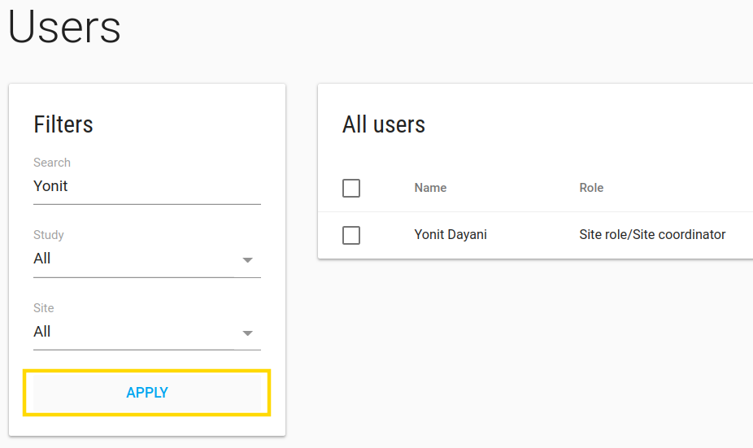

##Default Users
By default, you have 4 Users assigned to your study:

    1.Customer admin User - This is your User!
    2.CRC Default - CRC User
    3.PI Default - PI User
    4.CRA Default - CRA User
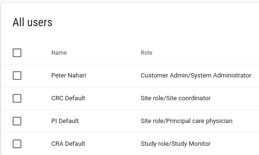

**Each default User has another permissions.**

##Edit User
Edit the default Users to your right Users one by one, by **ACTIONS**-> **EDIT** option

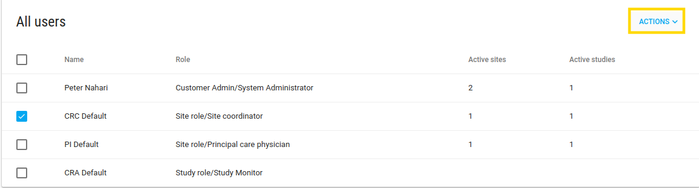

###Profile
In the User profile page there is a pencil icon in the right corner of **Profile card**, click on it in order to edit the User properties.

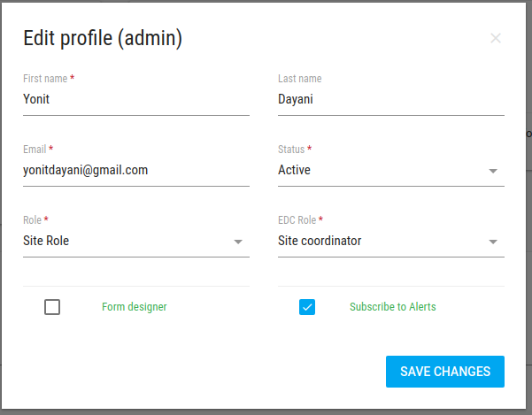

After you create a new User or modify their email, you can send them an email to create password by clicking on **Send create password**

You don't have to do it - your Users can log in with their Google account.

---
**NOTES:**
In edit User Profile action you can change a few User's parameters

1. *Role* There are 3 roles
    * Customer Admin - User has all customer permissions - add/edit studis, Users, sites, alerts and etc.
    * Study Role - User has study permissions - to see all study data (of all the sites)
    * Site Role - User has site level permissions - to see his site data, add subject to his site, create events and crfs to subject.  
2. *Form designer*: define if User has Forms permissions - add/edit/delete Events and CRFs from the system (by default only customer admin Users can do it).
3. *Subscribe to Alerts*: define if ths User will get alerts from this study (according to alert rules).
---

###Studies
In **Studies card** you can see the User's studies

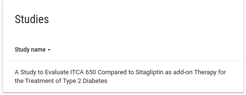

###Sites
In **Sites card** you can see the User's sites (if the User is study role or customer admin he can see al study's sites)

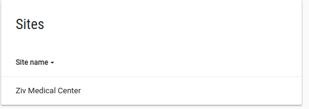

###Comments
In **Comments card** you can add comments about this User.
Write your comments and click on **ADD COMMENT** button

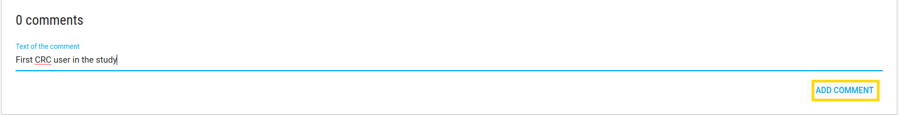

##Mange User sites
In User profile page you have an option to manage User sites.

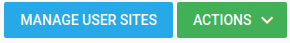

---
**NOTE:** You have this option just if the User is a site role User, otherwise the User has permissions to all study's sites

---
In manage User sites page you can add/remove sites from User privileges.

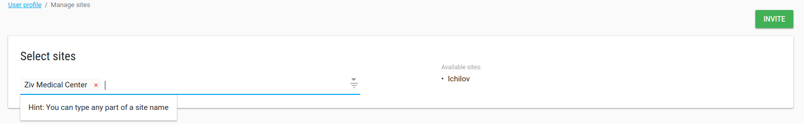

##User actions
In User profile page you have **ACTIONS** green button.
In these actions button you have a few actions options:

1. **Send create password** - By clicking on this option you email the User with create a new password request.
2. **Login as this User** - By clicking on this option you login to the system like you are this User.
3. **Modify password** - By clicking on this option you can modify the User password.

    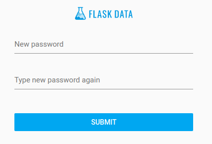

##Add User
To add User click on **ADD USER** green button in Users index page

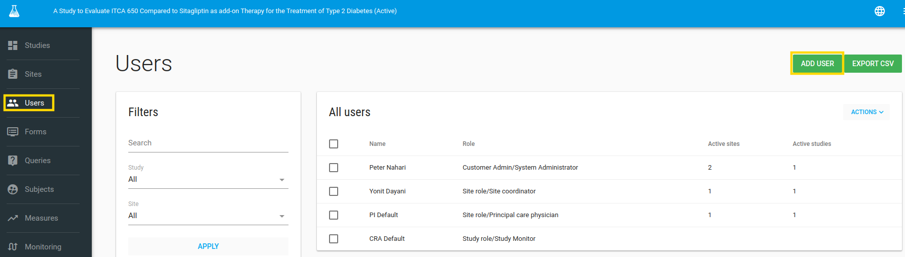

The User will be added to the selected study that appears in the title.

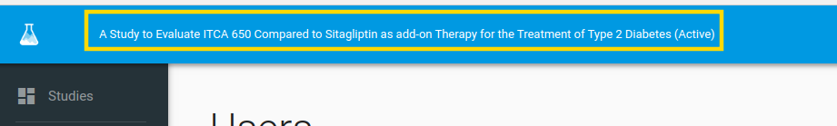

---
**NOTES:**

1. **Email** should be unique for each User.
2. **Role** There are 3 optional roles:
    2.1 Customer Admin - Administrator of the customer - who has all permissions of this account, like - create User, create site, build CRFs etc.
    2.2 Study role - who has all study permissions - see, extract etc. all study data.
    2.3 Site role - who has specific site/s permissions - add subject to his site, fill CRFs, see site's data etc.
3. **EDC Role** - more specific role from Role (number 2), it's more relevant for customers that have EDC db.
---

Click on **SAVE** green button.

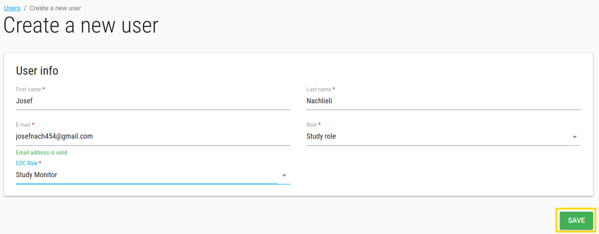

The User will get a Welcome message in their email.

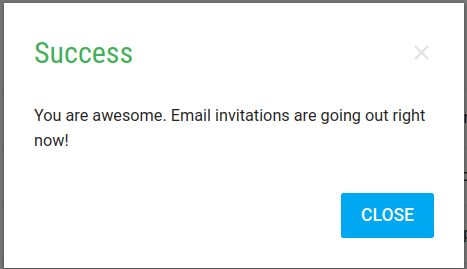
