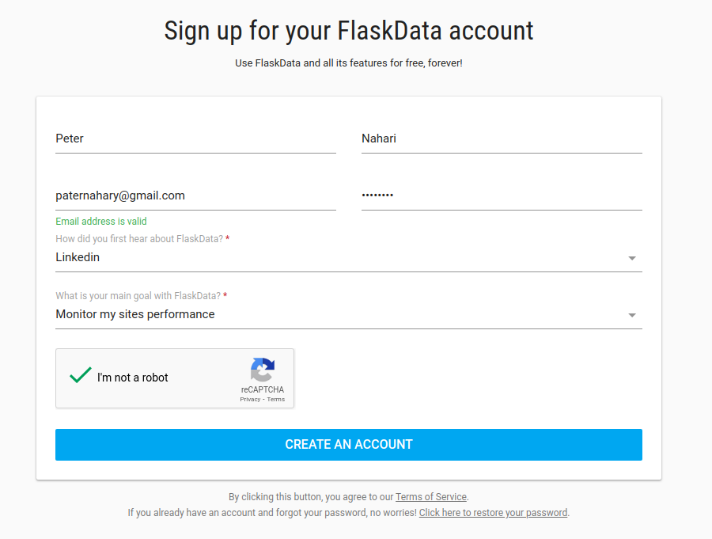

#Registration

Welcome to FlaskData :tada:

FlaskData is a cloud API platform for clinical data collection and automated monitoring.

Flaskdata is used in clinical trials to shorten R&D timelines, and in patient care to acquire real-world evidence for safety and efficacy of
therapeutics.

FlaskData is exposed as an open cloud API and is based on a foundation of IAM (identity access management) with strong security & privacy to protect clinical
data assets.  FlaskData complies with regulatory requirements for 21 CFR Part
11, GDPR, HIPAA and Israeli Privacy Rule.

Flaskdata provides 3 kinds of application services: Collect, Detect and Act.

FlaskData Collect provides a RESTful API, desktop and mobile apps to manage research studies, and to interact with patients, investigators and devices in clinical trials.

FlaskData Detect enables you to define patterns of protocol deviations.

FlaskData Act automates alert notifications to patients and clinical teams on exceptions and missing data.

###Audience
Clinical trial management and operations teams - anyone who is involved with creating and running pre and post-market clinical R&D.

##Create a new account
How to create a new account? It's so simple...

Go to <a href="https://app.flaskdata.io/users/register">Registration</a>

Fill in your information  and click **CREATE AN ACCOUNT**

A welcome email will be sent to you.

You're welcome to [define your first study](./first_study.md#define-your-study)

##Short video example of registration

<iframe width="560" height="315" src="https://www.youtube.com/embed/tEkjXn-SwCc" title="YouTube video player" frameborder="0" allow="accelerometer; autoplay; clipboard-write; encrypted-media; gyroscope; picture-in-picture" allowfullscreen></iframe>