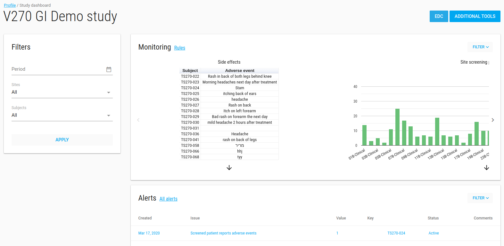
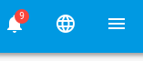
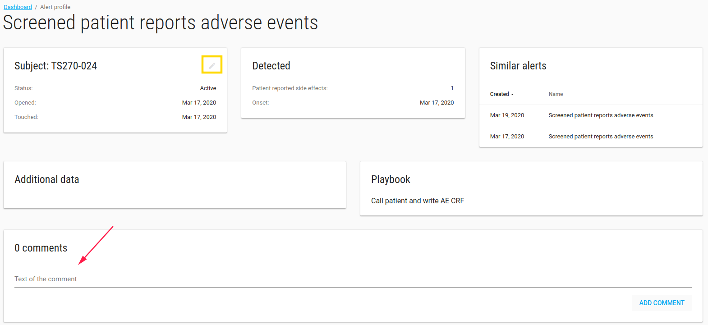
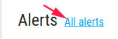
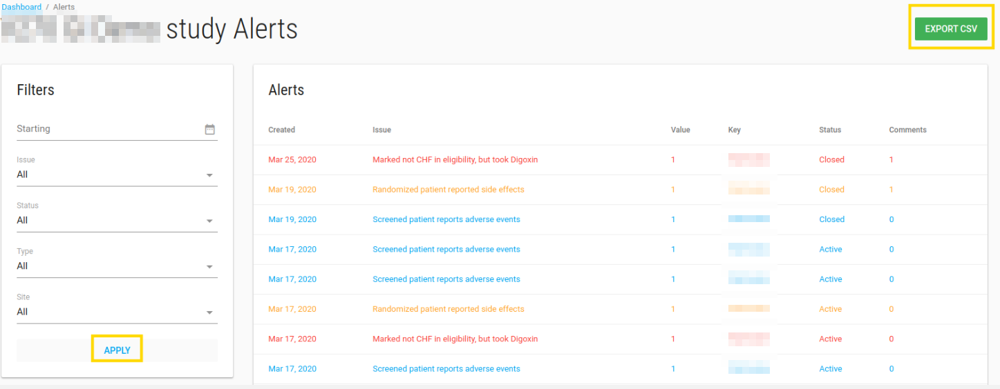
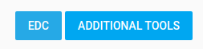
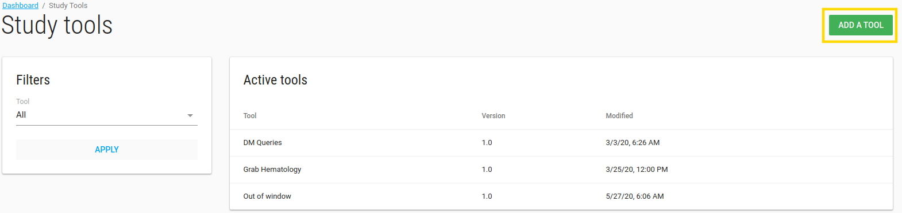

#Study Dashboard

Study Dashboard show your study monitoring.

In [studies index](./manage_studies.md#studies) page, click on your study, now you see your study dashboard.

---
**IMPORTANT** By press on study the study name appear in title bar and all the actions will be related to this study (like add user, add site etc.)

___

To see your data monitoring in the dashboard you should define it first in monitoring option.

##Monitoring
In the monitoring section there is a slick with analytics of your study data.

The graphs can be as bar, pie, table etc. With different colors (red, green or blue)

##Alerts
In alerts card there is a table withe the last 10 active alerts.

If there are active alerts to this study a bell appears in title bar with the number of alerts.

You can click on each alert to see more properties, add comments or change its status.

To see all alerts of this study click on **All alerts** blue link

###All Alerts
In study All Alerts page you can see all alerts of this study.

You can filter the alerts, export them to CSV file and update alert status by press on alert.

##Filters
In study dashboard page there is a filter option.

* Period - alert date <= this select date
* Sites
* Subjects

This filter filters graphs and alerts accordingly.

##EDC
If this study has [EDC DB](./manage_studies.md#add-study) **EDC** blue button appears.

Click it opens a new window with study ClinCapture app.

##Additional Tools
There is option to add tools to your study.

The optional tools exist in [Tools](./tools.md#tools).

If you want other users (study role and site role users) to see tools you need to add them to specific study.

Click on **ADDITIONAL TOOLS** blue button, Study tools page opens.

You can add/remove tool from this study by click on **ADD A TOOL** green button.

Manage tools page opens:

Study tools page available to all research users.

By pressing tool you enter that tool and see the data (Of course site role users can only see their site data).

