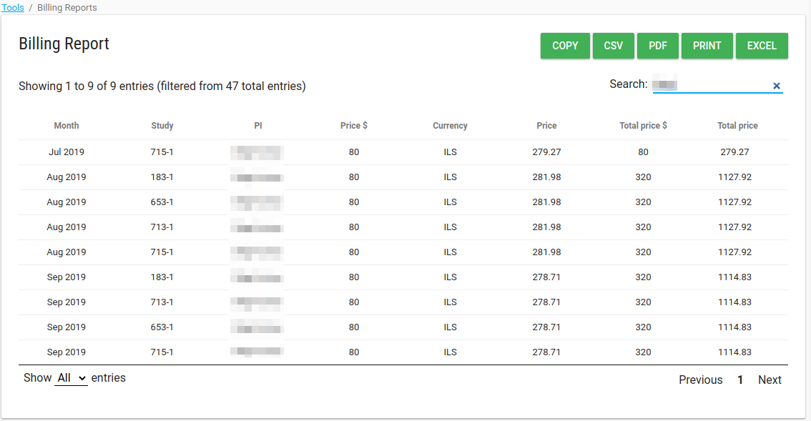

#Tools
In left menu bar there is a **Tools** option.

There is a list of default tools, each customer has.

**NOTE** If you need special tool open a [support request](./index.md#request-support).

##Audit Report
In the Audit Report tool, there are a few filter options:

* Audit logs:
    * database_audit_log - who changed data and when
    * policy_changes_audit_log - changes to database audit policy, who changed and when
    * login_audit_table - Successful and failed login attempts
    * object_access_audit - Object access operations (select) at level of ObjectController profile views
    * account_management_log - of activities by the  super admin and customer admin (create user, add study, remove from study etc..at level of UserController
* From date - logs date >= this date
* To date - logs <= this date

You can extract this report (CSV, Excel, PDF) and free search in the logs.

##Billing Report
If your account has [billing report feature](./manage_features.md#monthly-billing-report-for-customer-administrator), you can see all your reports in this table.

##Download Study Data CSVs
This tool download FormsStudyData.zip folder with all your study's data.

There is a CSV file for each CRF.

##Studies Report
This table includes all your [studies](./manage_studies.md#studies) and a few parameters of them

* IRB Number - study unique protocol id
* Protocol Title - study official title
* PI Name - PI user name
* Auth Name - [idp_user_id](./manage_features.md#idp-configuration)
* Enrollment target - study enrollment target
* Active - Number of active [subjects](./manage_subjects.md#manage-subjects)
* Not-active - Number of closed [subjects](./manage_subjects.md#manage-subjects)
* Start date - study start date
* End date - study completion date
* Status - study status
