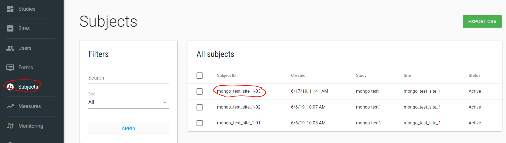
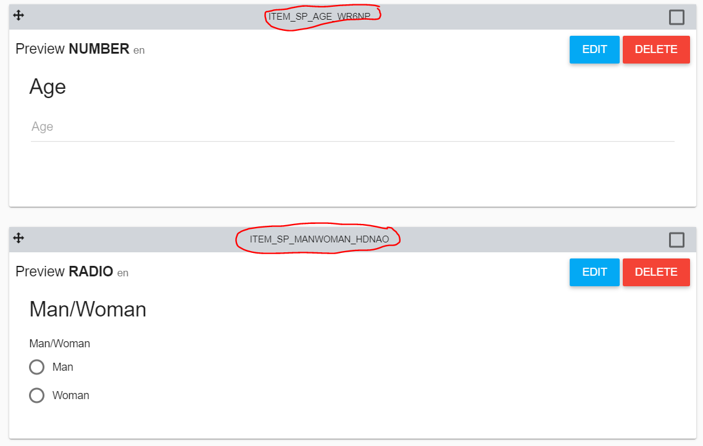
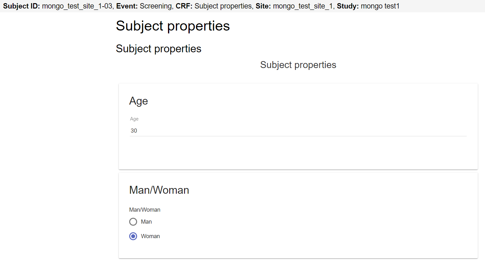

# API flows

The API has 2 parts of APIs - EDC and Flask.

* EDC - APIs are related to ClinCapture EDC (extract EDC data and etc.)
* Flask - APIs are related to flask data (extract data, insert data and etc.)

NOTES:

* Authorization parameter in the header request should be the token you had get before from you [authorization request](index.md#authorization).

* EDC parameter in the header request should be the EDC DB name.

In this document there are a few examples of FlaskData APIs - There are more EDC APIs, their description exists in swagger.

For more details and questions contact us by sending email to <a href="mailto:support@clearclinica.com">support@clearclinica.com</a>.

## EDC

### Extract EDC Data
There are a few APIs you can use to extract your ClinCapture EDC data.

For example:
#### /edc/study/extract-data
This API extract EDC data of each table/view/function (like functionName()) and return json.

fromDate, toDate, sort, filters and inputVariables(if tableName is a function) are optional values.

Filters and inputVariable json objects - the key is the column name/ input variable name in postgres, the json value is the compare value (like where site = XXX)/ input value in function (like schema.function(XXX)).

For example:

```{
  "tableName": "cc_event_data",
  "fromDate": "2017-01-01T00:00:00.000Z",
  "toDate": "2019-02-01T00:00:00.000Z",
  "sort": "subject"
}```

Another example:

```{
  "tableName": "cross_event_crf_data"
}```

#### /edc/study/download-csvs-data
This API download a zip folder includes EDC study data. Each csv is an event CRF data.

#### /edc/study/extract-study-data-at-crf-level
This API extract EDC data at CRF level and return the data as a json object.

This API return only CRFs with data.

This API have filters option (from date and to date are related to date_updated column, filters can include each column and value with equal sign).

#### /edc/study/extract-study-data-at-crf-level-to-csvs
This API extract EDC data at CRF level and return a zip folder includes CSV files (each CRF as CSV file).

This API return only CRFs with data.

This API have filters option (from date and to date are related to date_updated column, filters can include each column and value with equal sign).

#### /edc/subjects/create-subject
This API create a subject in EDC DB and return the study_subject_id value.

## Flask

### /flask/customer/extract-data-to-json
This API extract data from flask tables and views for your customer.

The table/ view should have customer_id column for this process.

For example: studies table, audit_user_login, billing_reports_customer and etc.

studyIds and filters are optional.

### /flask/customer/download-billing-reports
This API download a billing reports folder for the month of the billingDate parameter.

The billing report zip folder includes all the billing report files for your customer.

NOTE - This process will download files only if the billing reports features turn on in your customer account.

### /flask/device/get-logs
This API returns device logs of a study.

### /flask/device/insert-log
This API inserts device log into flaskData with correct study_id according to EDC.

payload parameter is optional and can include each key value pairs.

### /flask/study/create-update-flask-study
This API creates/updates study in FlaskData.

### /flask/site/create-update-flask-site
This API creates/updates site in FlaskData.

### /flask/study/create-update-flask-study-users
This API create user if not exists and assigned users to study.

NOTE - This API delete the users that were assigned to this study and assigned the new users.

### /flask/subject/extract-study-event-data-to-CSV
This API extract all study data (from FlaskForms) based on study id and download CSV files.

## Use Cases

### General example of extract data using JS:
    var xhrcall = $.ajax({
                            url: 'https://dev-api.flaskdata.io/flask/customer/extract-data-to-json',
                            type: 'POST',
                            headers: {
                                'Authorization': jwt},
                            data: '{
                                    "tableName": "studies",
                                    "fromDate": "2018-03-29T11:44:12.511Z",
                                    "toDate": "2019-03-29T11:44:12.511Z"                                    
                                  }',
                              contentType: 'application/json'
                          });
      //promise syntax to render after xhr completes
      xhrcall
          .done(function(data){
                  // Enter your code here
          })
          .fail(function(error) {
                    if(error) {
                        // Enter your code here  
                    }
          });

### Save data in CRF.

Your study uses FlaskForms application.

You have a mobile app and you want to collect data and save it to a Flask Forms Event/CRF

This JS code is an example to create CRF and save its data into existing event.

        $(document).ready(function() {
              // Call insertDataIntoFlaskFormsCRF function to assign new CRF and save data.
              // Input values : user email, user password, study id, subject label, event name, CRF name, CRF data.
              insertDataIntoFlaskFormsCRF("mongositerole@clearclinica.com", "123456", 145858, 'mongo_test_site_1-03', 'Screening', 'Subject properties', {"ITEM_SP_AGE_WR6NP":30, "ITEM_SP_MANWOMAN_HDNAO":2});
         });
        var insertDataIntoFlaskForms = function(uEmail, uPass, studyId, subjectLabel, eventName, crfName, crfData){
            // Get token
            getFlaskDataToken(uEmail, uPass, function(userToken){
                var token = userToken;
                // Get mongo subject Id by label
                getSubjectId(token, studyId, subjectLabel, function(subjectId){
                    //console.log(subjectId);
                    // Get current event token by event name (the event should be added to the subject )
                    getSubjectEventToken(token, subjectId, eventName, function(eventLinkId, eventToken){
                        //console.log(eventLinkId);
                        // Add new CRF in current event
                        getEventLinkProperties(token, eventLinkId, function(linkProperties){
                            // get CRF id by crf name
                            getCrfId(token, studyId, crfName, function(crfId){
                                // Assinged new CRF to existing event for specific subject
                                assingNewCrfInEvent(token, eventLinkId, linkProperties, crfId, function(newLinkProperties, crfdataId){
                                    //console.log("New CRF dataId : " + crfdataId);
                                    // GET crf PROPERTIES
                                    getCrfProperties(eventToken, crfdataId, function(crfProperties){
                                        //console.log(crfProperties);
                                        // Save CRF data
                                        saveCrfData(eventToken, crfProperties, crfData, crfdataId, function(resultStatus){
                                          console.log(resultStatus);
                                        });
                                    });
                                });
                            });
                        });
                    });
                });
            });
        }

        var getFlaskDataToken = function(email, password, cb) {
              // Get JWT token
              var xhrcall = $.ajax({
                                      url: 'https://dev-api.flaskdata.io/auth/authorize',
                                      type: 'POST',
                                      data: '{"email":"' + email + '","password":"' + password +'"}',
                                        contentType: 'application/json'
                                    });
                //promise syntax to render after xhr completes
                xhrcall
                    .done(function(data){
                            // Enter your code here
                            cb(data.token);
                    })
                    .fail(function(error) {
                              if(error) {
                                  // Enter your code here
                                  console.log('Failed to get token ' + error);
                              }
                    });
          }


          // Get list of subject in the study (for example studyId = 209843), filter by subject label and return its mongo subject id
          // /flask/subject/filter
          var getSubjectId = function(token, study_id, subject_label, cb) {
              var xhrcall = $.ajax({
                                      url: 'https://dev-api.flaskdata.io/flask/subject/filter',
                                      type: 'POST',
                                      headers: {
                                          'Authorization': token},
                                      data: '{"pagination": {"page": 0,"size": 10000,"sort": "name,asc" },"study_id": ' +study_id+ ' }',
                                      contentType: 'application/json'
                                    });
                //promise syntax to render after xhr completes
                xhrcall
                    .done(function(data){
                            // Enter your code here
                            var subjects = data.items;
                            cb(subjects.filter(s => s.subjectId == subject_label)[0].id);
                    })
                    .fail(function(error) {
                              if(error) {
                                  // Enter your code here
                                  console.log('Failed to get study subjects for study ' + study_id + ' :'+ error);
                              }
                    });
          }

          // Get list of subject events and crfs
          // /flask/link/filter
          var getSubjectEventToken = function(token, subjectId, eventName, cb) {
              var xhrcall = $.ajax({
                                      url: 'https://dev-api.flaskdata.io/flask/link/filter',
                                      type: 'POST',
                                      headers: {
                                          'Authorization': token},
                                      data: '{"pagination": {"page": 0,"size": 10000,"sort": "name,asc" },"subject": "' +subjectId+ '",  "status": "" }',
                                      contentType: 'application/json'
                                    });
                //promise syntax to render after xhr completes
                xhrcall
                    .done(function(data){
                            // Enter your code here
                            var events = data.items;
                            cb(events.filter(e => e.name.ENGLISH == eventName)[0].id, events.filter(e => e.name.ENGLISH == eventName)[0].token);
                    })
                    .fail(function(error) {
                              if(error) {
                                  // Enter your code here
                                  console.log('Failed to get subject event token :'+ error);
                              }
                    });
          }

          // Get list of crfs - filter on crf specific
          // /flask/crf/filter
          var getCrfId = function(token, studyId, crfName, cb) {
              var xhrcall = $.ajax({
                                      url: 'https://dev-api.flaskdata.io/flask/crf/filter',
                                      type: 'POST',
                                      headers: {
                                          'Authorization': token},
                                      data: '{"pagination": {"page": 0,"size": 10000,"sort": "name,asc" },"study_id": "' +studyId+ '"}',
                                      contentType: 'application/json'
                                    });
                //promise syntax to render after xhr completes
                xhrcall
                    .done(function(data){
                            // Enter your code here
                            var crfs = data.items;
                            cb(crfs.filter(c => c.name.ENGLISH == crfName)[0].id);
                    })
                    .fail(function(error) {
                              if(error) {
                                  // Enter your code here
                                  console.log('Failed to get list of CRFs :'+ error);
                              }
                    });
          }

        // Get CRFs properties - list of crfs
          ///flask/viewer/{token}/data
          var getCrfProperties = function(token, crfdataId, cb) {
              var xhrcall = $.ajax({
                                      url: 'https://dev-api.flaskdata.io/flask/viewer/'+token+'/data',
                                      type: 'GET',
                                      contentType: 'application/json'
                                    });
                //promise syntax to render after xhr completes
                xhrcall
                    .done(function(data){
                          //console.log(data);
                          cb(data.CRFs.filter(crf => crf.dataId == crfdataId)[0]);
                    })
                    .fail(function(error) {
                              if(error) {
                                  // Enter your code here
                                  console.log('Failed to get CRFs properties :'+ error);
                              }
                    });
          }

          // Get event link with all its properties
         // /flask/link/{linkId}
           var getEventLinkProperties = function(token, linkId, cb) {
               var xhrcall = $.ajax({
                                       url: 'https://dev-api.flaskdata.io/flask/link/'+ linkId,
                                       type: 'GET',
                                       headers: {
                                           'Authorization': token},
                                       contentType: 'application/json'
                                     });
                 //promise syntax to render after xhr completes
                 xhrcall
                     .done(function(data){
                           //console.log(data);
                           cb(data);
                     })
                     .fail(function(error) {
                               if(error) {
                                   // Enter your code here
                                   console.log('Failed to get link properties :'+ error);
                               }
                     });
           }

           // Update event link with new CRF
          // /flask/link/{linkId}
            var assingNewCrfInEvent = function(token, linkId, linkProperties, crfId, cb) {

                var dataId = Math.random().toString(36).substr(2, 10).toUpperCase();

                var newCRF = {"crf": crfId,
                             "omt": true,
                             "dataId": dataId,
                             "order": linkProperties.CRFs.length}
                linkProperties.CRFs.push(newCRF);

                var newStatus= {
                             "last_edited": new Date().toISOString(),
                             "dataId": dataId,
                             "status": "Started",
                             "_id":  crfId
                }
                linkProperties.statuses.push(newStatus);
                linkProperties.force = true;
                linkProperties.status = "Started"
                //console.log(JSON.stringify(linkProperties));
                var xhrcall = $.ajax({
                                        url: 'https://dev-api.flaskdata.io/flask/link/'+ linkId,
                                        type: 'PUT',
                                        headers: {
                                            'Authorization': token},
                                        data : JSON.stringify(linkProperties),
                                        contentType: 'application/json'
                                      });
                  //promise syntax to render after xhr completes
                  xhrcall
                      .done(function(data){
                            //console.log(data);
                            cb(data, dataId);
                      })
                      .fail(function(error) {
                                if(error) {
                                    // Enter your code here
                                    console.log('Failed to update link properties with new CRF :'+ JSON.stringify(error));
                                }
                      });
            }


          // Save CRF data
         // /flask/viewer/{token}/save-crf
           var saveCrfData = function(eventToken, crfProperties, crfData, crfdataId, cb) {
               Object.keys(crfData).forEach(function(itemData) {
                  crfProperties.sections.map(function(s) {
                      s.items.map(function(i) {
                          if(i.variable == itemData){
                              //console.log('item: ' + i.variable);
                              i.value = [crfData[itemData]];
                              i.dataId = crfdataId;
                              i.date_updated = new Date().toISOString();
                          }
                      });
                  });
               });
               crfProperties.completed = false;

               //console.log(JSON.stringify(crfProperties));
               var xhrcall = $.ajax({
                                       url: 'https://dev-api.flaskdata.io/flask/viewer/'+eventToken+'/save-crf',
                                       type: 'POST',
                                       data : JSON.stringify(crfProperties),
                                       contentType: 'application/json'
                                     });
                 //promise syntax to render after xhr completes
                 xhrcall
                     .done(function(data){
                           //console.log(data);
                           cb(data);
                     })
                     .fail(function(error) {
                               if(error) {
                                   // Enter your code here
                                   console.log('Failed to update link properties with new CRF :'+ JSON.stringify(error));
                               }
                     });
           }

Your application should call insertDataIntoFlaskFormsCRF function with the following input parameters:

* user email - Your customer API user email address for authorization.
* user password - Your customer API user password for authorization.
* studyId - Your study Id parameter, You can take it from study dashboard URL.

* Subject label - Subject label from flaskdata, for example:

* Event name for creating CRF, for example:

* CRF name for creating CRF, for example (in flask forms):

* CRF data - for saving CRF data, Json structure, key value pair, The key is the item's variable (as it's defined in flask forms) and the value is the data for this variable.
for example: `{"ITEM_SP_AGE_WR6NP":30, "ITEM_SP_MANWOMAN_HDNAO":2}`

The output should be new CRF for the subject with the correct data, for example:

